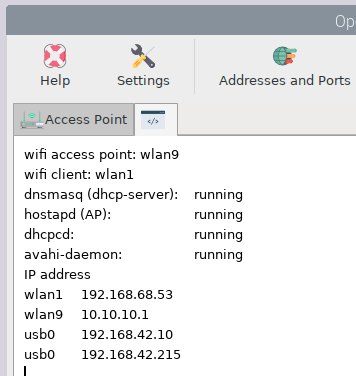

.. |mhelp| image:: ../img/help.png
.. |mSettings| image:: ../img/settings.png
.. |OPnet| image:: img/openplotter-network.png

|OPnet| Network
###############

.. note::
	To run this app type this in a terminal:

	.. parsed-literal::

		openplotter-network

.. image:: img/network0.png

|mhelp| ``Help`` opens an offline copy of this documentation in a browser and |mSettings| ``Settings`` opens the main app *OpenPlotter Settings*.

The purpose of this app is to provide useful information about your network and create an access point (AP) that other devices can connect to to share data. 

Addresses and Ports

Check Network

Station (on board)
##################

If you only want to connect to an access point as a station using your built-in WiFi device and it is not being used as an access point, you will use the tool provided by your system to make the connection as usual:

.. image:: img/network1.png

AP (on board)
#############

.. image:: img/network2.png

.. image:: img/network3.png

.. image:: img/network4.png

AP + Station (on board)
#######################

.. image:: img/network5.png

.. image:: img/network6.png

Use Raspberry as router to connect a notebook or a plotter with an ethernet cable. Use the internal wlan as AP and station.

.. image:: img/network-rpi3-apandsta.gif

Picture 1: the RPi works like a router (AP) for your tablet or smartphone and gets Internet 

Advantage

* Less power consumption.
* A free USB port.

Disadvantage

* unstable
* Lower download performance.
* The Raspberry must be in a good place to get a good internet connection (unrealistic).

AP + Station (on board + usb)
#############################

.. image:: img/network7.png

.. image:: img/network8.png

.. image:: img/network9.png

.. image:: img/network-rpi3-ap+sta.gif

Picture 2: Same as Picture 1 but with a second WIFI device. *recommended*

AP + station (on board + tethering)
###################################

.. image:: img/network8.png

.. image:: img/network-rpi3-ap+tethering.gif

Picture 3: Same as picture 2 but with an Android smartphone connected by USB as a replacement for the WIFI device. The smartphone can be connected to the marina WIFI or to GSM internet. USB tethering must be activated.

Advantage

* You do not have to change the network mode when you get to a marina or leave it (Android switches automatically to GSM if it looses the wifi connection).
* One device for gsm and wifi
* Some marina AP aren't Linux friendly but will work good with Android

Disadvantage

* Tethering doesn't start automatically on some devices
* The USB-cable disturbs
* It can eat up your complete mobile internet volume

Features
********

* Access Point (AP)
* AP 2.4 GHz or 5 GHz
* Router functionality (eth0 and AP on the same subnet)
* AP and station mode (not recommended, not stable)
* Driver collection for special Wifi devices
* Individual settings
* Android USB tethering and reverse tethering
* IOS USB tethering when IOS is connected to the internet with GSM

The Network management is based on the native management system of Debian. You can connect to a hotspot as you do without openplotter-network.

Access Point (AP)
*****************

You can configure the Linux system to act as an AP (wifi-hotspot). Then you can connect to OpenPlotter with wifi devices like notebooks, tablets, smartphones, e-book reader,...

To setup a hotspot you first select the wifi device you want to act as AP (see picture network app on the left side behind AP). *We recommend to use the Raspberry on board wifi*.
(In V2.x the AP will always have the interface name wlan9)

AP 2.4 GHz or 5 GHz
*******************
If your AP and the devices can work with 5 GHz you can select it.

Router functionality
********************
On your internet router at home you can communicate on the same subnet between your ethernet connected devices and your wifi connected devices. If you wish that Linux treats the AP and ethernet port this way choose Add ethernet port to the AP.

.. Warning::
	When setup as router don't connect the ethernet port to a router! The router can malfunction, including communication paralyzes.

AP and station mode
*******************

The Raspberry built-in wlan device can act as AP and connect as a standard client (station mode) to the AP of the marina simultaneously. This does work but isn't stable. We recommend using an USB-wlan device to connect to the AP of the marina.
Or connect an Android smartphone to the Raspberry with an USB cable. Connect the smartphone to the marina wifi and turn on USB-tethering.

Driver collection for special Wifi devices
******************************************

If your wifi stick isn't recognized by Linux, you can try to install an extra drivers by pushing the "Install Wifi Drivers" button.

Individual settings
*******************

You have to give your AP a SSID (a name). This will pop up on smartphones etc. When they search for a wifi AP (hotspot).
Give your wlan a secure "Password"

Remember to set your wifi country correct (Settings->Raspberry-Pi-Konfiguration) .

.. Note::
	Not all selectable channels will work depending on the country setup.

You can choose a channel you like.

.. Note::
	In every marina the wlan traffic can be different. If you have network issues you can sometimes solve them by changing the channel.

Sharing Internet device is only important for any device that is connected to the Raspberry and needs internet connection. An incorrect setting makes no difference for the Raspberry itself.
*We recommend setting "Sharing Internet device" to auto.* Because Linux changes often wlan0 and wlan1.

The button *Update Sharing* changes the internet connection to the first internet gateway in the list of the command *route*.
This is important during the journey when switching the internet connection between devices.

If you have more than one internet connection. Linux will only use the one with the highest priority (lowest metric). This depends on the interface type and the number. In other words disconnect other internet connections and press the *Update Sharing* button

Android USB tethering and reverse tethering
*******************************************

In the section AP and station mode we already spoke about using the Android feature tethering. But you can do more with tethering. You can use the realvnc app to remote control the Linux desktop with your smartphone or tablet also if there is a wifi issue. The Raspberry will listen on the ip-address 192.168.42.10 .
The original USB-tethering idea (providing a GSM internet connection) can also be used.

(The interface name will be USB0)

.. Note::
	Android USB-tethering: Every time you restart Linux or reconnect the cable you have to switch on USB-tethering again (on some devices).

IOS USB tethering when IOS is connected to the internet with GSM
****************************************************************

On IOS you can use the remote control with the vnc viewer only if you have a gsm internet connection. 
Go to settings switch personal hotspot and connect the USB-cable.
The rapberry will listen on the ip-address 172.20.10.3 .
(The interface name will be eth1)

.. admonition:: Advantages of USB-tethering

	* Emergency replacement if your display is broken
	* If your mouse or keyboard does not work
	* If your network does not work
	* In headless use

Check Network
*************

Picture 4: Shows the network status (how it should look if everything is okay + usb0 USB-tethering Android).