.. |mhelp| image:: ../img/help.png
.. |mSettings| image:: ../img/settings.png
.. |OPnet| image:: img/openplotter-network.png
.. |OPnetAdd| image:: img/ports.png
.. |OPnetEdit| image:: img/edit.png
.. |OPnetSave| image:: img/ok.png

|OPnet| Network
###############

.. note::
	To run this app type this in a terminal:

	.. parsed-literal::

		openplotter-network

.. image:: img/network0.png

|mhelp| ``Help`` opens an offline copy of this documentation in a browser and |mSettings| ``Settings`` opens the main app *OpenPlotter Settings*.

The purpose of this app is to provide useful information about your network and create an access point (AP) that other devices can connect to in order to share data.

|OPnetAdd| ``Addresses and Ports`` is a really useful tool. It will inform you about all the ports that are being used in your system by different applications and the existence of possible conflicts between them:

.. image:: img/network10.png

Next we will explain the different operating modes of the AP.

Station (on board)
##################

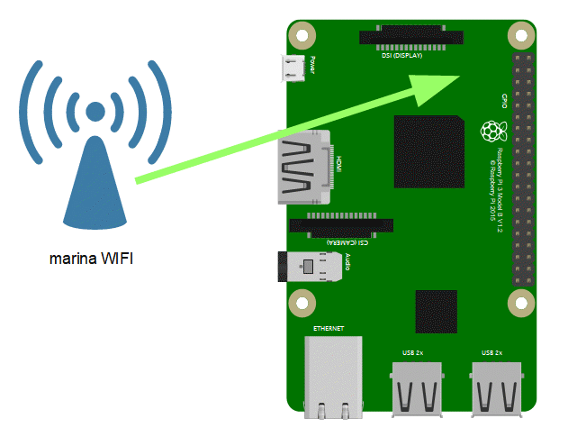

If you do not want to set up an access point and just want to connect your system to an external access point as a station using your built-in WiFi (on board), you will use the tool provided by your system to make the connection as usual and will set *AP* to *none*:

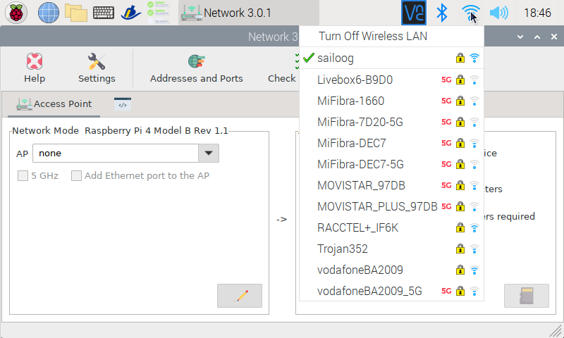

AP (on board)
#############

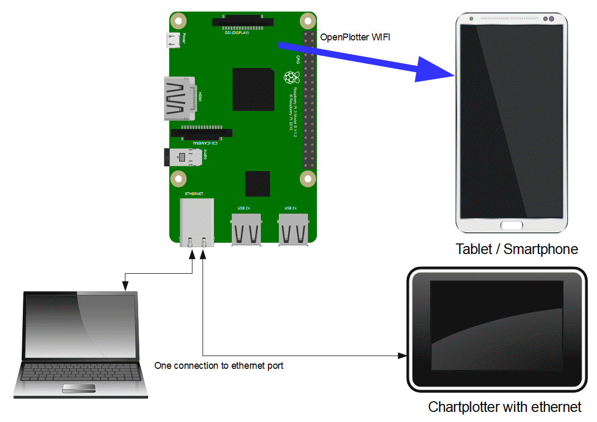

Instead of connecting to an external access point, you can use the built-in WiFi (on board) to create your own access point and connect any onboard device such as tablets, smartphones, laptops...

Select *on board* in ``AP`` field. By default the AP works at 2.4 GHz but if the built-in WiFi device and the external devices can work at 5 GHz you can check the ``5 GHz`` field. On your router at home, you can communicate on the same subnet with your Ethernet-connected devices and your WiFi-connected devices. If you want OpenPlotter to treat the AP and Ethernet port this way, check ``Add Ethernet port to AP``:

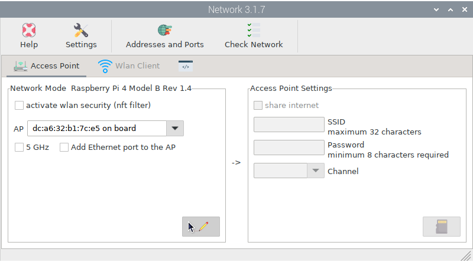

Noww you are ready to configure some settings of your AP, click |OPnetEdit| ``edit`` to enable the next window. You are not connected to internet, so select *none* in ``sharing Internet device`` field. You have to give to your AP a ``SSID`` (a name). This name will be listed when your external devices search for a WiFi AP. Give your wlan a secure ``Password``. You can choose a channel you like. Not all selectable channels will work depending on the country setup of your system. If you are having network problems, you can sometimes solve them by changing the channel to a less crowded one. Click |OPnetSave| ``Save`` when done and OpenPlotter will reboot to apply the changes:

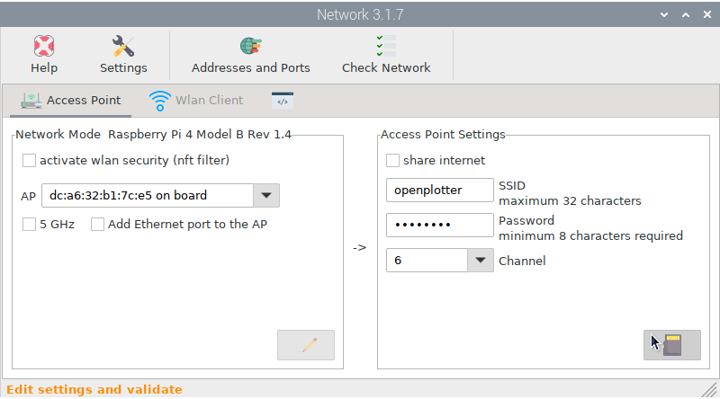

After reboot, you will see the SSID listed as an available AP by searching from your onboard WiFi devices, confirm you can connect them to your new AP. The built-in WiFi is now busy working as an AP, so it will not be able to connect to the marina AP as you can see in the image below:

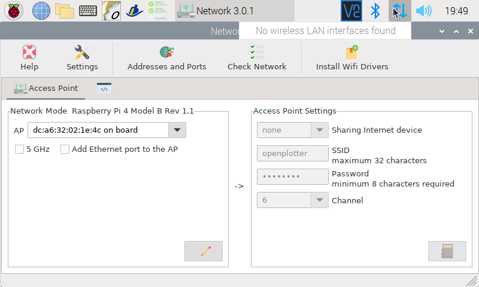

AP + Station (on board)
#######################

**Under construction...**

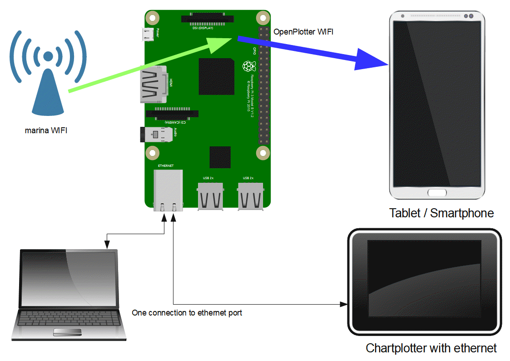

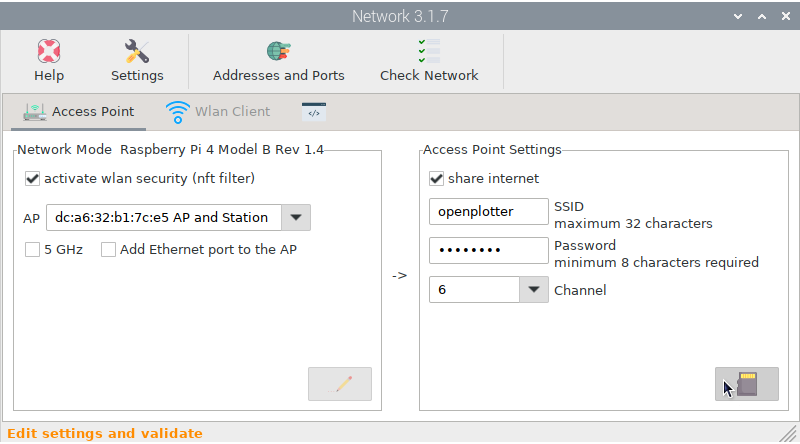

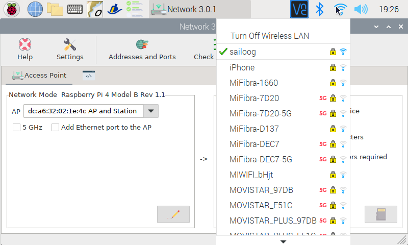

AP + Station (on board + usb)
#############################

**Under construction...**

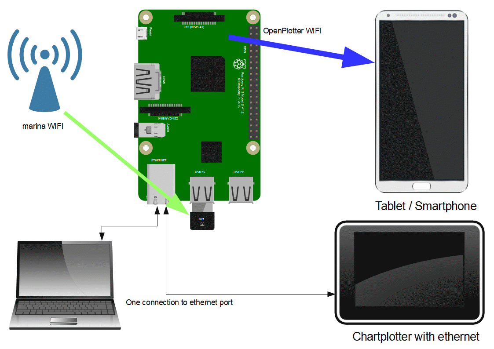

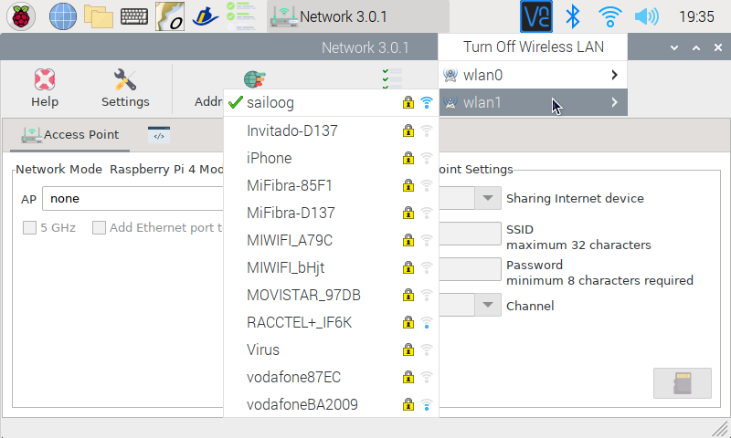

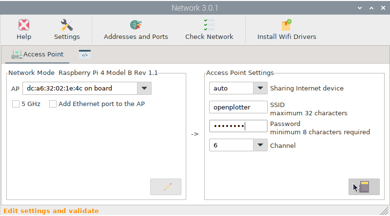

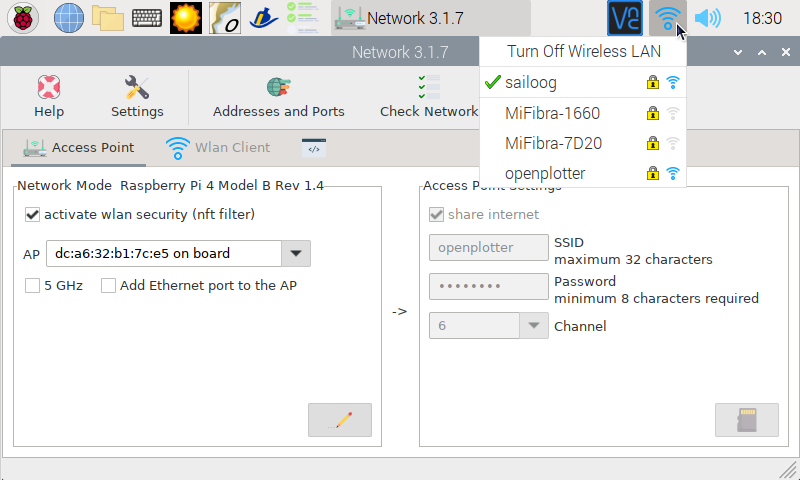

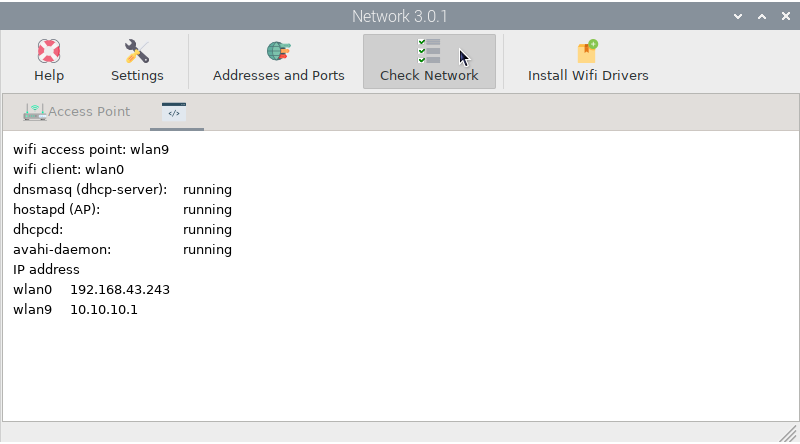

AP + station (on board + tethering)
###################################

**Under construction...**

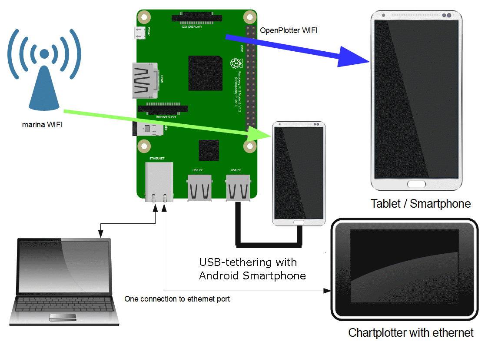

