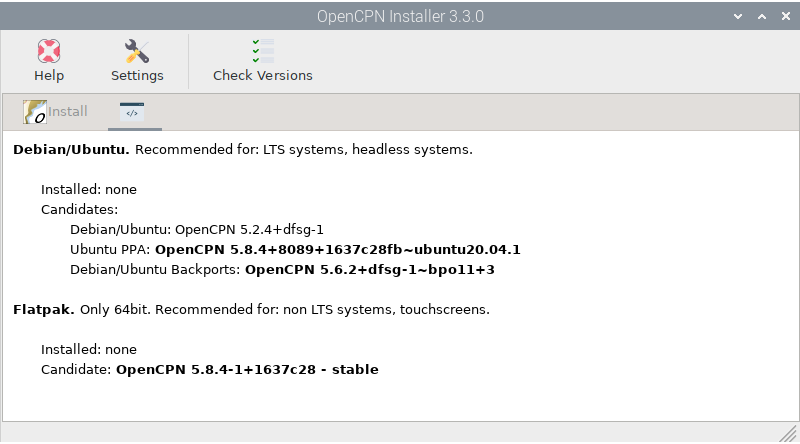

.. |OPopencpn| image:: img/openplotter-opencpn-installer.png
.. |OPopencpnCheck| image:: img/check.png
.. |OPopencpnBack| image:: img/debian.png
.. |OPopencpnFlatpak| image:: img/flatpak.png
.. |OPopencpnUpdate| image:: img/caution.png
.. |OPopencpnUninstall| image:: img/uninstall.png
.. |OPopencpnAutostart| image:: img/autostart.png
.. |OPopencpnFullscreen| image:: img/fullscreen.png
.. |OPopencpnOpen| image:: img/open.png
.. |OPopencpnPlugins| image:: img/opencpn24.png
.. |OPopencpnSK| image:: img/sk.png
.. |mhelp| image:: ../img/help.png
.. |mSettings| image:: ../img/settings.png

|OPopencpn| OpenCPN Installer
#############################

.. note::
	To run this app type this in a terminal:

	.. parsed-literal::

		openplotter-opencpn-installer

.. image:: img/opencpn0.png

|mhelp| ``Help`` opens an offline copy of this documentation in a browser and |mSettings| ``Settings`` opens the main app *OpenPlotter Settings*.

OpenCPN can be installed on multiple Debian derivatives (Raspberry OS, Ubuntu, Mint...) and these OS can be installed on multiple architectures (i386, armhf, arm64, amd64...). We have added all the ways to install OpenCPN to this *OpenPlotter OpenCPN Installer* app so you can choose the one that best suits your system.

|OPopencpnCheck| Check Versions
*******************************

When you open the app, all buttons are disabled. You have to check the current versions present in all the installed sources. This could take even a minute the first time:

.. image:: img/opencpn1.png

A list will be displayed with the different versions of all the available sources and some recommendations:

You can install OpenCPN in two different ways, from the **Debian/Ubuntu** repositories or from **Flatpak**. You can use both ways and install two instances of OpenCPN that can be used simultaneously on the same machine without problems. 

In Flatpak there is only one source and therefore only one version but in Debian/Ubuntu there are several sources and several versions available:

- **Debian/Ubuntu**: This is the official Debian/Ubuntu repository. There is an OpenCPN package, but it will probably always be old.

- **Ubuntu PPA**: This is an special repository to be added in Ubuntu but it will also work in Debian and Raspberry OS. Packages in this repository are always up to date and are fully compatible with packages in the official Debian/Ubuntu repositories above.

- **Debian/Ubuntu Backports**: The official backports repositories are used to install packages that exist in higher versions of the system that have not yet been updated in the current system version.

Which source to choose?
***********************

After checking versions the buttons on the |OPopencpnPlugins| ``Install`` tab will now be enabled:

.. image:: img/opencpn4.png

- |OPopencpnBack| **Debian/Ubuntu - Ubuntu PPA**: This option will install the highest version found in the official *Debian/Ubuntu* repository and the *Ubuntu PPA* repository.

- |OPopencpnBack| **Debian/Ubuntu Backports**: This option will install the latest version in the official *Debian/Ubuntu Backports* repository.

- |OPopencpnFlatpak| **Flatpak**: This option will install the latest version in the *Flatpak* repository. This option runs OpenCPN in a kind of container independent of the host system and for this reason the time and size of the download will be larger. 

.. important::
	As a general rule, you should always choose the highest version, regardless of the source, unless you fall within one of the recommended uses or there is an OpenCPN plugin you need to use that is not included in any of the sources.

.. note::
	At the time of writing this manual, OpenCPN Flatpak is the best option for touch screens because it allows right-clicking and two-finger zooming. However OpenCPN Flatpak may not work well in headless environments.

.. note::
	The Debian/Ubuntu repositories only release OpenCPN packages for LTS (Long-Term Support) versions of your operating system. If you use a development version of Debian or Ubuntu you should use OpenCPN Flatpak.

.. note::
	Sometimes when we install a new version, some plugins may not be compatible and cause OpenCPN to crash or prevent it from opening. If this happens we can try to remove the old plugins by deleting the *~/.local/lib/opencpn* folder and reinstalling the plugins when OpenCPN opens normally again.

If you install OpenCPN twice, from Debian/Ubuntu and Flatpak, the system will differentiate between them by adding the FP suffix to the version installed from Flatpak:

.. image:: img/opencpn5.png

OpenCPN Installer actions
*************************

Once OpenCPN is installed, there are a few actions you can take in this app. 

- You can |OPopencpnUninstall| ``Uninstall`` OpenCPN at any time.

- By checking |OPopencpnAutostart| ``Autostart``, OpenCPN will run automatically at startup and by checking |OPopencpnFullscreen| ``Full Screen``, it will use the entire screen.

- By clicking |OPopencpnOpen| ``Open``, OpenCPN will run.

|OPopencpnSK| Signal K connection
#################################

To receive data from all your devices and sensors on OpenCPN, the recommended way is to create all connections on the Signa K server and then create a single connection to the server on OpenCPN using these settings:

:Type: Network

:Protocol: signal K

:Address: localhost

:DataPort: 3000

:Uncheck: Automatic server dicovery

.. image:: ../img/opencpnConnection.png