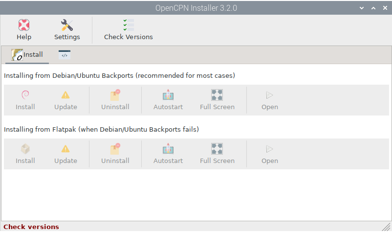
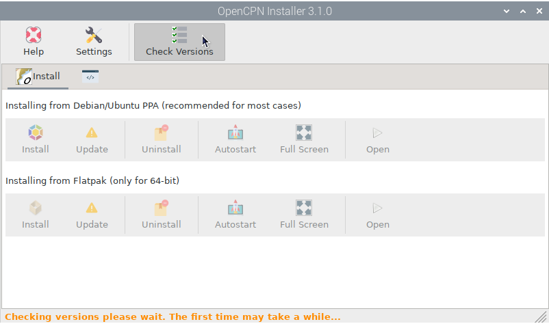
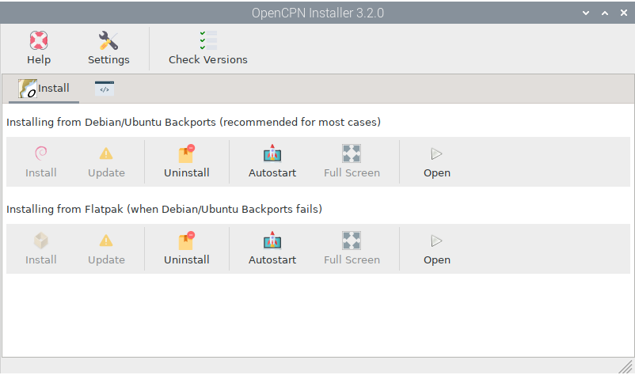
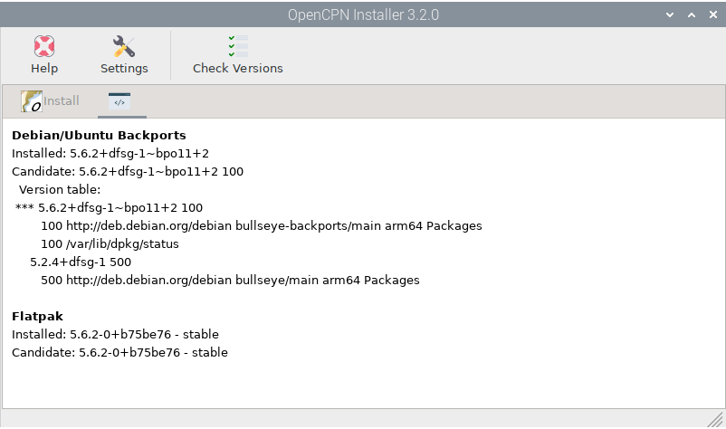
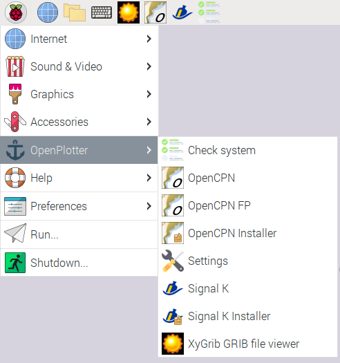

.. |OPopencpnCheck| image:: img/check.png
.. |OPopencpnBack| image:: img/debian.png

.. |OPopencpnUninstall| image:: img/uninstall.png
.. |OPopencpnAutostart| image:: img/autostart.png
.. |OPopencpnFullscreen| image:: img/fullscreen.png
.. |OPopencpnOpen| image:: img/open.png
.. |OPopencpnPlugins| image:: img/opencpn24.png
.. |OPopencpnSK| image:: img/sk.png
.. |mhelp| image:: ../img/help.png
.. |mSettings| image:: ../img/settings.png

|OPopencpn| OpenCPN Installer
#############################

.. note::
	To run this app type this in a terminal:

	.. parsed-literal::

		openplotter-opencpn-installer

|mhelp| ``Help`` opens an offline copy of this documentation in a browser and |mSettings| ``Settings`` opens the main app *OpenPlotter Settings*.

OpenCPN can be installed on multiple Debian derivatives (Raspberry OS, Ubuntu, Mint...) and these OS can be installed on multiple architectures (i386, armhf, arm64, amd64...). We have added all the ways to install OpenCPN to this *OpenPlotter OpenCPN Installer* app so you can choose the one that best suits your system.

|OPopencpnCheck| Check Versions
*******************************

When you open the app, all buttons are disabled. You have to check the current versions present in all installed sources. This could take even a minute the first time:

A list with the different versions from all the sources will be displayed so that you can choose the right one. The buttons on the |OPopencpnPlugins| ``Install`` tab will now be enabled.

Which source to choose?
***********************

As a general rule, you should choose *Debian/Ubuntu Backports*, but if the plugin you need is not available for your system or if you are running a non-LTS system, choose the Flatpak installation. Both *Debian/Ubuntu Backports* and *Flatpak* installations can coexists without problem:

|OPopencpnBack| Debian/Ubuntu Backports
=======================================

This option contains two sources that are compatible with each other, the official Debian/Ubuntu Stable repository and the official Debian/Ubuntu Backports repository. If you choose this option the Debian/Ubuntu Backports version will be installed because the Debian/Ubuntu Stable version will rarely be higher.

|OPopencpnFlatpak| Flatpak
==========================

This option runs OpenCPN in a kind of container independent of the host system. For this reason the time and size of the download will be larger. This option is perfect if your system is non-LTS (Long Term Support) or at that moment the plugin you need does not exist in the Debian/Ubuntu Backports version. At the time of writing this manual, there are some known issues with headless environments that could prevent OpenCPN Flatpak from running.

OpenCPN Installer actions
*************************

Once OpenCPN is installed, there are a few actions you can take in this app. 

- You can |OPopencpnUninstall| ``Uninstall`` OpenCPN at any time.

- If there is an |OPopencpnUpdate| ``Update``, this button will be enabled.

- By checking |OPopencpnAutostart| ``Autostart``, OpenCPN will run automatically at startup and by checking |OPopencpnFullscreen| ``Full Screen``, it will use the entire screen.

- By clicking |OPopencpnOpen| ``Open``, OpenCPN will run.

|OPopencpnSK| Signal K connection
#################################

To receive data from all your devices and sensors on OpenCPN, the recommended way is to create all connections on the Signa K server and then create a single connection to the server on OpenCPN using these settings:

:Type: Network

:Protocol: signal K

:Address: localhost

:DataPort: 3000

:Uncheck: Automatic server dicovery

.. image:: ../img/opencpnConnection.png