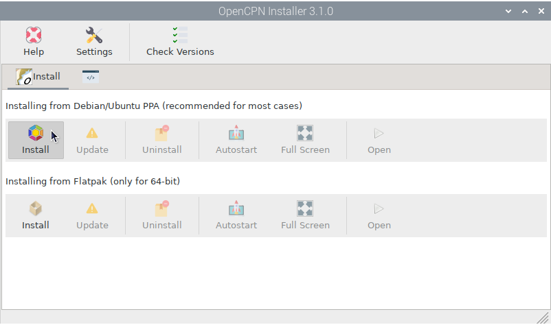

.. |OPopencpn| image:: img/openplotter-opencpn-installer.png
.. |OPopencpnCheck| image:: img/check.png

.. |OPopencpnFlatpak| image:: img/flatpak.png
.. |OPopencpnUpdate| image:: img/caution.png
.. |OPopencpnUninstall| image:: img/uninstall.png
.. |OPopencpnAutostart| image:: img/autostart.png
.. |OPopencpnFullscreen| image:: img/fullscreen.png
.. |OPopencpnOpen| image:: img/open.png
.. |OPopencpnPlugins| image:: img/opencpn24.png
.. |OPopencpnSK| image:: img/sk.png
.. |mhelp| image:: ../img/help.png
.. |mSettings| image:: ../img/settings.png

|OPopencpn| OpenCPN Installer
#############################

.. note::
	To run this app type this in a terminal:

	.. parsed-literal::

		openplotter-opencpn-installer

.. image:: img/opencpn0.png

|mhelp| ``Help`` opens an offline copy of this documentation in a browser and |mSettings| ``Settings`` opens the main app *OpenPlotter Settings*.

OpenCPN can be installed on multiple Debian derivatives (Raspberry OS, Ubuntu, Mint...) and these OS can be installed on multiple 32-bit and 64-bit architectures (i386, armhf, arm64, amd64...). Using different sources, you will be able to install OpenCPN for any combination of OS and architecture, but plugins may not be available for a given combination. For this reason, we have added all the available sources to install OpenCPN to this *OpenPlotter OpenCPN Installer* app so you can choose the one that best suits your combination of OS and architecture.

|OPopencpnCheck| Check Versions
*******************************

.. image:: img/opencpn1.png

.. image:: img/opencpn2.png

Which version to choose?
************************

As a general rule, you should choose Debian/Ubuntu PPA, but if the plugin you need is not available for your system or if it is not the latest version of OpenCPN, choose the Flatpak installation. Both *Debian/Ubuntu PPA* and *Flatpak* installations can coexists without problem:

.. image:: img/opencpn5.png

|OPopencpnPPA| Debian/Ubuntu PPA
================================

|OPopencpnFlatpak| Flatpak
==========================

.. image:: img/opencpn4.png

|OPopencpnPlugins| Installing plugins
=====================================

|OPopencpnUpdate| Update
************************

|OPopencpnUninstall| Uninstall
******************************

|OPopencpnAutostart| Autostart
******************************

|OPopencpnFullscreen| Full Screen
*********************************

|OPopencpnOpen| Open
********************

|OPopencpnSK| Signal K connection
#################################

:Type: Network

:Protocol: signal K

:Address: localhost

:DataPort: 3000

:Uncheck: Automatic server dicovery

.. image:: ../img/opencpnConnection.png