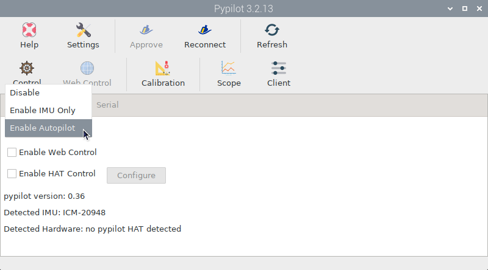
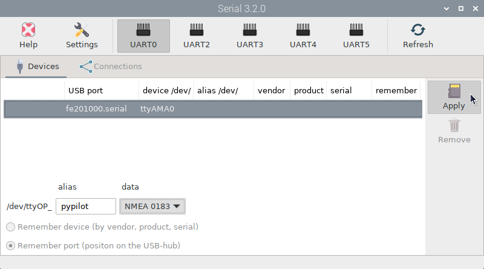
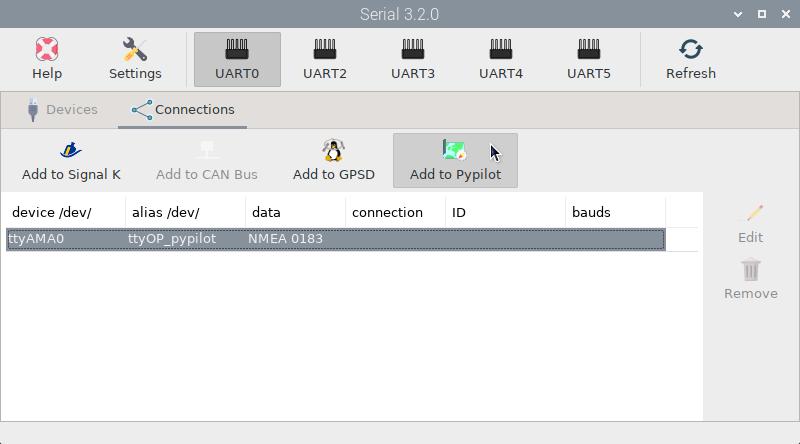
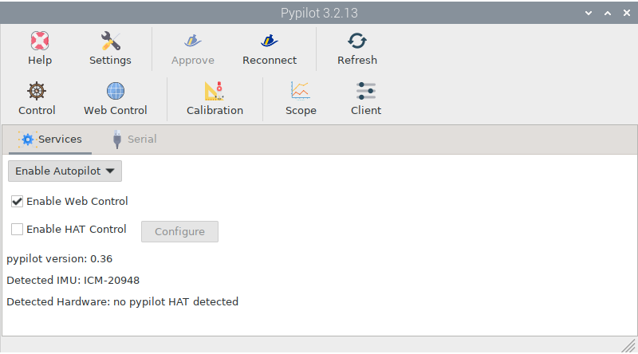
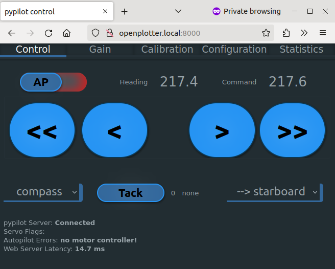
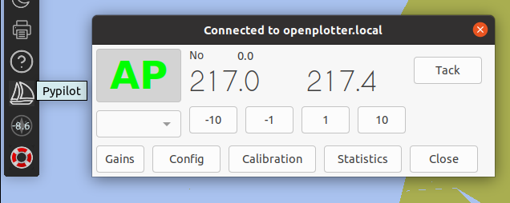

.. |OPserialUart| image:: img/uart.png
.. |OPserialConnections| image:: img/connections.png

.. |OPserialApply| image:: img/apply.png
.. |PYservice| image:: img/process.png
.. |PYautopilot| image:: img/autopilot.png
.. |PYcontrol| image:: img/control.png
.. |PYopen| image:: img/open.png

Autopilot mode
##############

Enable this mode in the |PYservice| *Services* tab **only** if you are using a Pypilot motor controller:

You also need one of the IMUs recommended in the previous chapter. Do not forget to :ref:`calibrate<calibration>`.

The motor controller can be purchased from the official `Pypilot store <https://pypilot.org/opencart/>`_.

As a motor you can use the one from your old autopilot if it still works or an `industrial equivalent <https://pcnautic.nl/nl/autopilot/pcnautic-bare-tillerdrive-detail>`_ like these replacements for the `Raymarine Q047 <https://pcnautic.nl/nl/autopilot/raymarine-q047-replacement-detail>`_, the `EV-100/SPX-5 <https://pcnautic.nl/nl/autopilot/ev-100-spx-5-tiller-drive-replacement-set-detail>`_ or the `ST4000+ <https://pcnautic.nl/nl/autopilot/st4000-tiller-drive-replacement-set-detail>`_. But you can also use `other types of motors <https://pypilot.org/wiki/doku.php?id=rudder_drive_motor>`_ that are not normally used in marine environments.

Finally you might also need the Pypilot HAT to control the autopilot although this element is optional because you have other ways to control it as we will see later. The Pypilot HAT can be purchased from the official `Pypilot store <https://pypilot.org/opencart/>`_.

Connecting the motor controller
*******************************

On one side you have to connect the controller to the motor and on the other side to one of the UART ports of the Raspberry Pi following this scheme:

+--------------------------+--------------+
| Pypilot motor controller | Raspberry Pi |
+===========+==============+==============+
| Vcc                      | 3V3          |
+--------------------------+--------------+
| RxD                      | UART TX      |
+--------------------------+--------------+
| TxD                      | UART RX      |
+--------------------------+--------------+
| GND                      | GND          |
+--------------------------+--------------+

You can use any of the available UART interfaces on your Raspberry Pi model. See the :ref:`UART<uart>` chapter to find out which one to choose.

In the following example we are going to use the UART0 interface which is the only one available for both the Raspberry Pi 3 and 4 models. Go to the |OPserialUSB| *OpenPlotter Serial* app and click the |OPserialUart| ``UART0`` button, acknowledge the warning and reboot. After the reboot, launch the |OPserialUSB| *OpenPlotter Serial* app again. On the |OPserialUSB| ``Devices`` tab, you should now see a new entry. Select the line with *ttyAMAx*, give it an *alias* (for example *pypilot*) and select *NMEA 0183* from the *data* dropdown, then press |OPserialApply| ``Apply``:

Finally we need to connect the ttyOP_pypilot device to Pypilot. Switch to the |OPserialConnections| ``Connections`` tab, select the *ttyOP_pypilot* device and click |PYautopilot| ``Add to Pypilot``:

In the next window click ``AUTO`` and that is it. The motor controller will be ready to receive orders from Pypilot.

Feeding data to autopilot
*************************

Pypilot receives data from the IMU and forwards it to the Signal K server automatically when we steer in *compass mode* using the magnetic heading as reference.

We can also steer in *GPS mode*, using the course over ground as reference, or in *wind mode* and *true wind mode*, keeping the apparent wind angle or the true wind angle respectively. In these cases, Pypilot will get the necessary data from the Signal K server automatically when these devices are defined there. If we want to decrease the latency of this data we can also add these devices directly to Pypilot using the |OPserialUSB| *OpenPlotter Serial* app in the same way that we have added the motor controller. Pypilot will take care of sending the data from these devices also to the Signal K server so that other programs can use them.

Autopilot control
*****************

Once we have connected the hardware and we are feeding Pypilot with the necessary data, we can start to control our autopilot using any of the available interfaces. All interfaces can be used in parallel and have all the options you would normally find on any autopilot.

Only one of them is physical and the rest are virtual. The virtual control interfaces can be used from the same device running OpenPlotter and two of them can also be used remotely from other devices, such as a mobile phone connected to the same network as OpenPlotter. The physical control interface, the Pypilot HAT, can also be used remotely via an infrared remote control.

All control interfaces share the same options and parameters that we will briefly explain later.

|PYcontrol| **Control**

.. image:: img/interface_control.png

You can access this virtual interface only from the system running OpenPlotter by clicking the |PYcontrol| ``Control`` icon in the |PYautopilot| *OpenPlotter Pypilot* app.

|PYopen| **Web Control**

You can access this virtual interface from the system running OpenPlotter by clicking the |PYopen| ``Web Control`` icon in the |PYautopilot| *OpenPlotter Pypilot* app or by typing the address *https://localhost:8000* in the browser. Before you can use this interface you need to activate it in the |PYservice| *Services* tab, checking the ``Enable Web Control`` option.

You can also use this interface remotely from any device connected to the same network as your OpenPlotter system by typing the address *https://openplotter.local:8000* in the browser.

|PYplugin| **OpenCPN plugin**

You can access this virtual interface from the system running OpenPlotter by installing and enabling the *pypilot* plugin in OpenCPN. Before you can use this interface, you must connect pypilot by clicking ``Config`` and supplying the *host*. The *host* is *localhost* when your pypilot instance runs on the same system as OpenCPN or *openplotter.local* when your pypilot instance runs on another system on the same network.

**Pypilot HAT**

This is the physical interface of Pypilot. It basically consists of a small LCD digital screen, a small keyboard and an infrared sensor for a remote control. Before you can use this interface you need to activate it in the |PYservice| *Services* tab, checking the ``Enable HAT Control`` option.

Pypilot should automatically detect the HAT. You can modify some parameters by clicking the ``Configure`` button or by typing the address *https://localhost:33333* in the browser. Note that the web interface at port 33333 has a startup delay of 30 seconds.

Parameters
**********

These are some of the parameters that you will find in all control interfaces:

:AP: 

:Heading: [Heading - Command]

:Mode: [Compass - GPS - Wind - True Wind]

:<< < > >>: 

:Tack: [starboard - board]

:Gain: [P - I - D - DD - PR - FF]

:Rudder:

:Settings:

:Client:

:Scope: 
