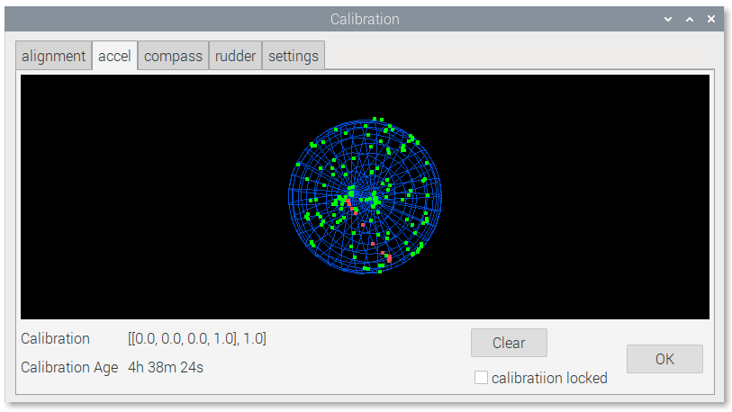
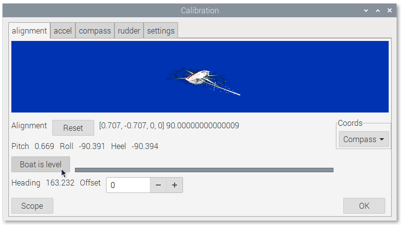
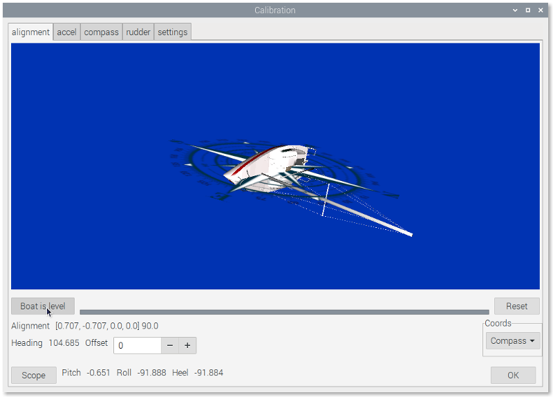

.. _calibration:

Compass calibration
###################

Follow these steps in order:

1. Accelerometer bias
*********************

Most IMU require accelerometer bias calibration. Without it, there will be significant pitch and roll errors. The mpu9250 and mpu9255 usually are factory calibrated meaning you could skip this step. However, some of these do not have this calibration, these usually have an orange rather than yellow capacitor. The IMU on the Moitessier HAT should be ok. In any case, it is recommended to calibrate the accelerometer bias, even if factory calibrated as it will improve the factory calibration slightly.

To calibrate the accelerometer bias, you must be on a “mostly” stable platform. It may be impossible to do at anchor if the boat is moving too much, so either in flat water, or land for this step.

Go to ``Pypilot app`` and click on ``Calibration``. In Calibration window click on ``accel`` tab.

You can determine that a new calibration has been applied by ``Calibration Age`` value. Make sure ``calibration locked`` is not enabled.

Carefully place the sensor on each of the 6 sides of a box (+- 10 degrees will do) the actual orientation is not critical, so long as enough measurements can be taken to fit a sphere. Leave the sensors in each position for a few seconds.

Once a calibration is applied the accelerometer calibration age should reset. If it does not, repeat the process putting the sensors in different orientations until a calibration fix is found.

If you use the cheapest sensors, sometimes they have bad accelerometers. Either one axis will always read zero, or they will saturate because the bias is greater than 1g. This is easy to determine from the accelerometer calibration plot in calibration window. 

2. Alignment
************

Once the accelerometers are calibrated, the sensor should be fixed securely to the boat. This is required for correct operation and if they are moved or remounted, both alignment and compass calibration must be performed again (but not accelerometer calibration).

To perform alignment, ensure the boat is level (not heeling or pitching) and in relatively calm water (but small waves motion of a few degrees is ok). Go to ``alignment`` tab and click  ``Boat is level`` button.

Correct alignment must be performed before the compass calibration can begin. 

.. Attention::
	IF you are using a Raspberry Pi 4 you will not be able to see the boat rendered. There is an error with OpenGL and this is enabled by default in Rapsberry  Pi 4. If you disable OpenGL or you are using a Raspberry 3 you should see the boat. this error does not affect calibration or alignment. We will try to fix this ASAP.

3. Compass
**********

Be sure to locate the sensors away from:

- magnets - speakers and especially moving magnets like a floating compasses
- current carrying wires - very simple rule is 2 cm (1 inch) for every amp
- iron and steel - less critical, so if you are in a steel boat, just don't fix the sensors to a steel wall, but try to locate them several inches at least offset from it.

The compass calibration is mostly automatic. If the accelerometer and alignment are calibrated, you just need to sail turning more than 180 degrees to calibrate the compass.

Go to ``compass`` tab and make sure ``calibration locked`` is not enabled or updates will not occur.

There are both 2D and 3D compass calibration fixes. A 2D fix will occur from turning without pitching or heeling. When heeling there may be some error without a 3D fix. To obtain a 3D fix, you should make a circle with sufficient heeling, such as tacking against the wind, or rolling in waves.

Subsequent 2D fixes will use the previous undetermined value for 3D fix, combining the new 2D fix with the past information from a 3D fix. Performing accelerometer calibration will give a rough 3D fix in most cases making a subsequent 2D fix sufficient for most use.

Compass calibration is continuous and always updates unless locked. You may wish to lock it to prevent future calibration updates.

If the sensors are remounted, they must be re-aligned and the compass recalibrated.

If metal objects are moved around the sensors, the compass must recalibrate. 