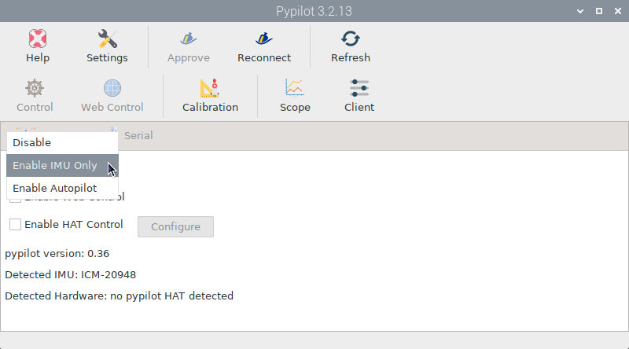

.. _imu:

.. |PYcali| image:: img/calibration.png

IMU Only mode
#############

Enable this mode in the |PYservice| *Services* tab if you are not using a motor controller and are only interested in adding an Inertial Measurement Unit (IMU) for heading, heel and trim data. Pypilot currently supports the following I2C-connected IMU models:

- ICM-20948 (recommended)
- MPU-9250
- MPU-9255.

The IMU should be automatically detected and displayed in the |PYservice| *Services* tab:

You do not need to do anything else to start receiving heading and attitude data on the Signal K server:

.. image:: img/pypilot4.png

.. important::
	You must |PYcali| :ref:`calibrate<calibration>` the IMU before you can obtain reliable heading data.