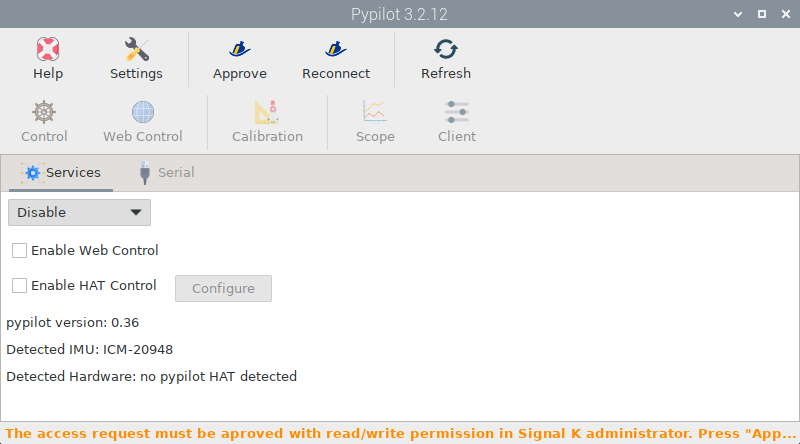
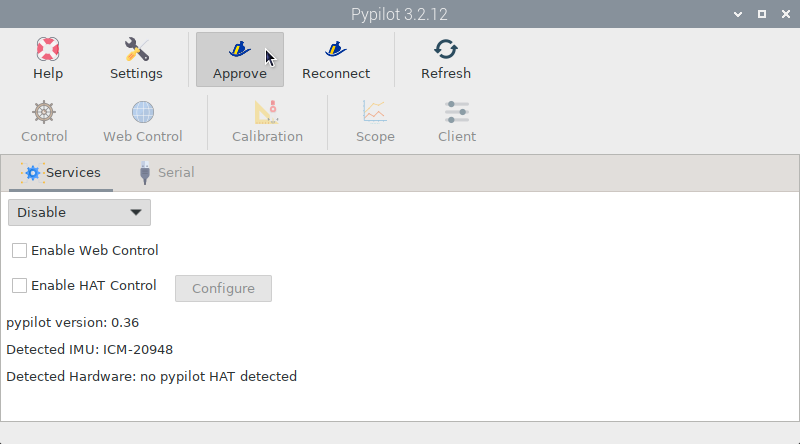
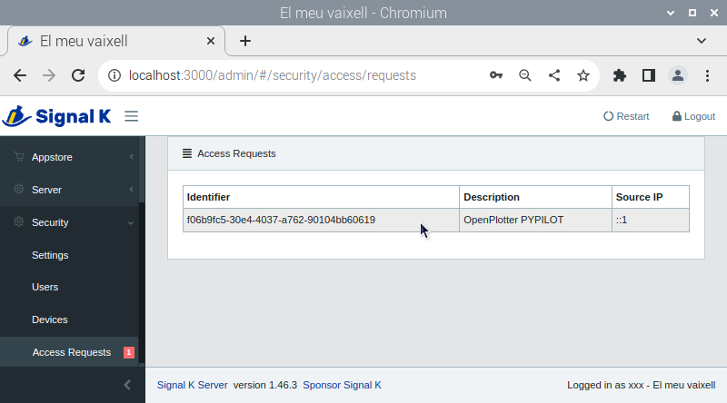
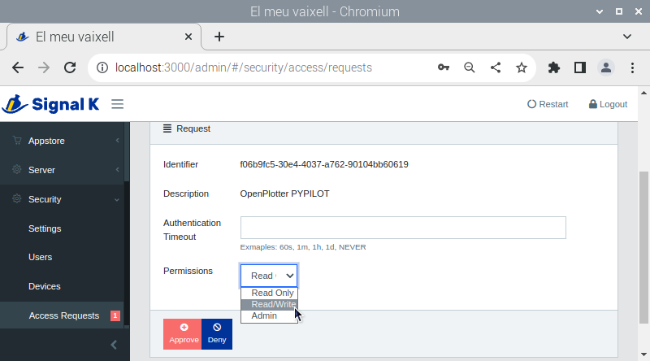

.. _pypilot:

.. |mhelp| image:: ../img/help.png
.. |mSettings| image:: ../img/settings.png

.. |OPsk| image:: img/sk.png
.. |OPrefresh| image:: img/refresh.png
.. |PYautopilot| image:: img/autopilot.png

|PYPILOT| Pypilot
#################

.. note::
	To run this app type this in a terminal:

	.. parsed-literal::

		openplotter-pypilot

|mhelp| ``Help`` opens an offline copy of this documentation in a browser and |mSettings| ``Settings`` opens the main app *OpenPlotter Settings*.

This app is used to integrate the open autopilot, *Pypilot*, into OpenPlotter. You can use Pypilot to install a full autopilot on your boat or simply add an Inertial Measurement Unit (IMU) for heading, heel and trim data. Read on to find out what you need for each of the modes.

.. important::
	Pypilot is a complex environment and you will find many tutorials with instructions for installing programs, editing configuration files or executing commands in the terminal. You do not need to do any of this in OpenPlotter because you can control Pypilot completely from its graphical interface.

The first time you run the |PYautopilot| *OpenPlotter Pypilot* app, you have to create a connection between this app and the Signal K server. Open the app and a connection request will automatically be sent to the Signal K server. Click |OPsk| ``Approve`` to access the administrator of the Signal K server:

Select the new request and then select *Read/Write* in *Permissions* and click ``Approve``:

Finally go back to the |PYautopilot| *OpenPlotter Pypilot* app and click |OPrefresh| ``Refresh``.
