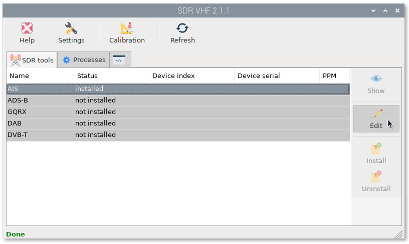
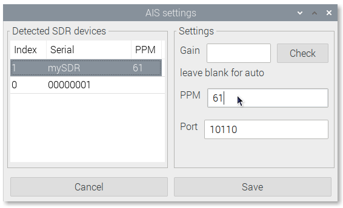
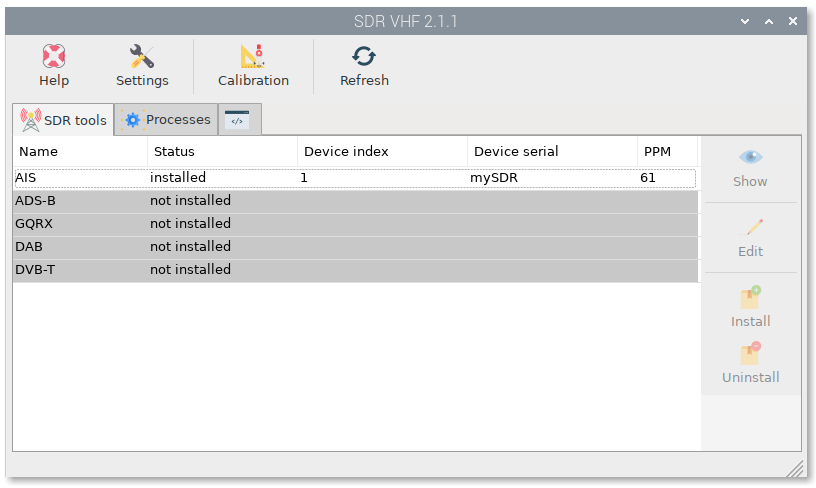
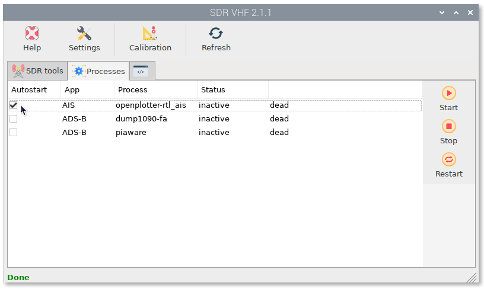
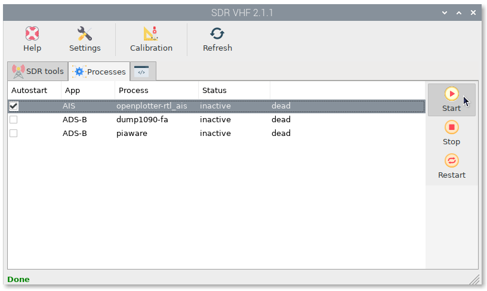
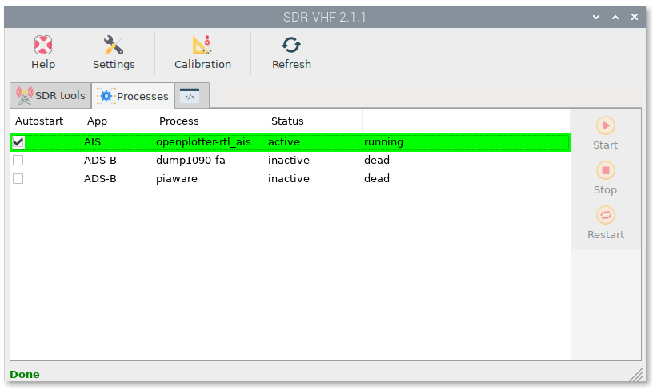
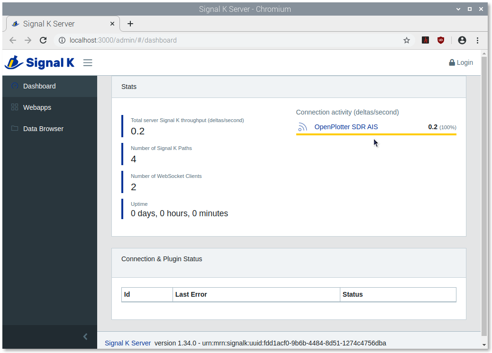
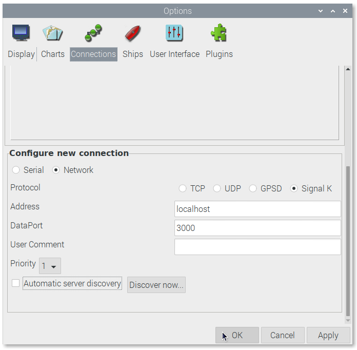
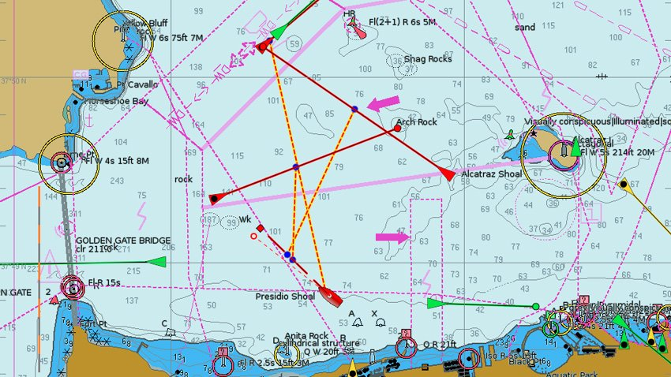

AIS
###

``AIS`` tool comes pre-installed in ``SDR VHF``. To start receiving AIS data you just have to follow a few simple steps.

Select ``AIS`` app and click on ``Edit``:

Select the device you want to use to get AIS data from the ``Detected SDR devices`` list.

You can set the receive ``Gain``. Not always the maximum gain will work better, we recommend leaving this field blank for auto.

Set the ``PPM`` value for your device. If you have calibrated your device, you should see this value in the device list. You can also set any value to test.

Provide a ``Port`` to send AIS data (default 10110). A UDP network connection will be created in Signal K automatically for that port.

Click on ``Save``.

Go to the ``Processes`` tab and check ``Autostart`` on AIS process to start getting data at system startup:

Finally, select the AIS process and click ``Start`` to start getting data:

If you see the AIS process in green, you are done:

To confirm that everything is working fine, go to the Signal K server and check if an ``OpenPlotter SDR AIS`` connection has been created and is getting data:

Then, go to OpenCPN and confirm that a connection with the Signal K server exists and is getting AIS data:

