.. |mhelp| image:: ../img/help.png
.. |mSettings| image:: ../img/settings.png
.. |OPSDR| image:: img/openplotter-sdr-vhf.png

|OPSDR| SDR VHF
###############

.. note::
	To run this app type this in a terminal:

	.. parsed-literal::

		openplotter-sdr-vhf

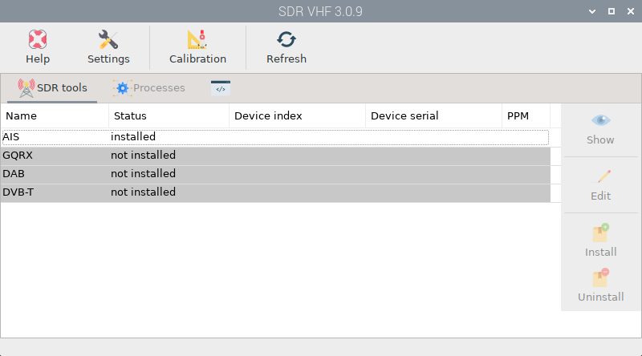

|mhelp| ``Help`` opens an offline copy of this documentation in a browser and |mSettings| ``Settings`` opens the main app *OpenPlotter Settings*.

This app will allow you to easily use `Software Defined Radio <https://www.rtl-sdr.com/buy-rtl-sdr-dvb-t-dongles/>`_  devices in OpenPlotter. These devices can be used as a wide band radio scanner. Applications include:

- Use as a police radio scanner.
- Listening to EMS/Ambulance/Fire communications.
- Listening to aircraft traffic control conversations.
- Tracking aircraft positions like a radar with ADSB decoding.
- Decoding aircraft ACARS short messages.
- Scanning trunking radio conversations.
- Decoding unencrypted digital voice transmissions such as P25/DMR/D-STAR.
- Tracking maritime boat positions like a radar with AIS decoding.
- Decoding POCSAG/FLEX pager traffic.
- Scanning for cordless phones and baby monitors.
- Tracking and receiving meteorological agency launched weather balloon data.
- Tracking your own self launched high altitude balloon for payload recovery.
- Receiving wireless temperature sensors and wireless power meter sensors.
- Listening to VHF amateur radio.
- Decoding ham radio APRS packets.
- Watching analogue broadcast TV.
- Sniffing GSM signals.
- Using rtl-sdr on your Android device as a portable radio scanner.
- Receiving GPS signals and decoding them.
- Using rtl-sdr as a spectrum analyzer.
- Receiving NOAA weather satellite images.
- Listening to satellites and the ISS (International Space Station).
- Radio astronomy.
- Monitoring meteor scatter.
- Listening to FM radio, and decoding RDS information.
- Listening to DAB broadcast radio.
- Listening to and decoding HD-Radio (NRSC5).
- Use rtl-sdr as a panadapter for your traditional hardware radio.
- Decoding taxi mobile data terminal signals.
- Use rtl-sdr as a high quality entropy source for random number generation.
- Use rtl-sdr as a noise figure indicator.
- Reverse engineering unknown protocols.
- Triangulating the source of a signal.
- Searching for RF noise sources.
- Characterizing RF filters and measuring antenna SWR.
- Decoding Inmarsat STD-C EGC geosynchronous satellites.

In this app we include some of these interesting tools for maritime use. Before you start using any of these bundled tools, there are a few steps you should take.

Edit device serial numbers
**************************

SDR devices can only be used by one program at a time. If you have more than one device you can select which one you want to use in some tools and some others will take the first available device. Most of the SDR devices available on the market have the same serial number (00000001) and this makes it difficult to identify them, so we have added a tool to change these serial numbers if necessary.

Click on |OPSDRcali| ``Calibration``

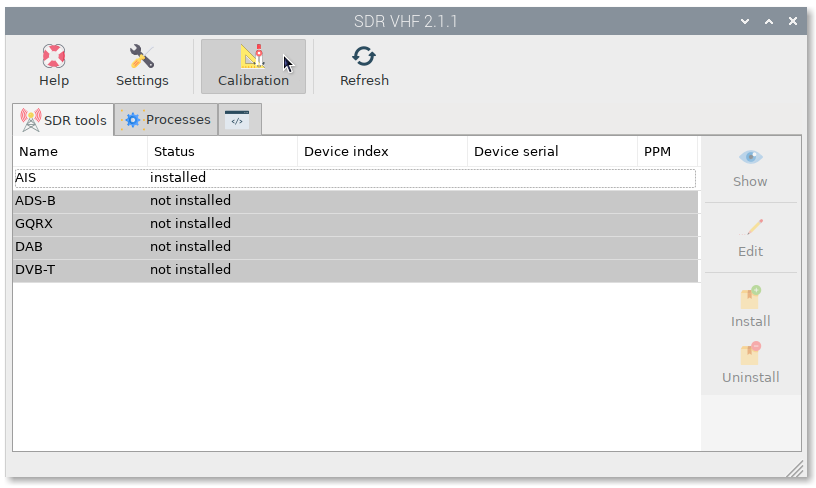

You will see the list of connected SDR devices. Select any of them, type a new name in *Serial* field and click on ``Change``:

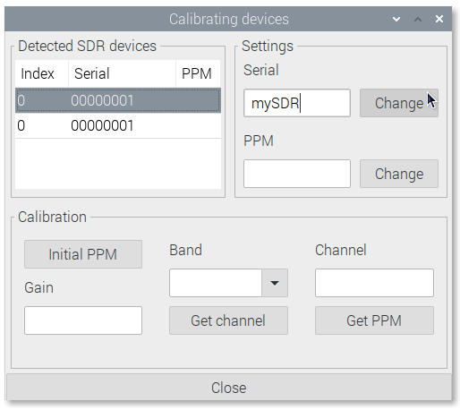

A new window will open asking for confirmation. Type ``y`` and press enter. Finally replug the device and open again the |OPSDRico| *SDR VHF* app to check the changes.

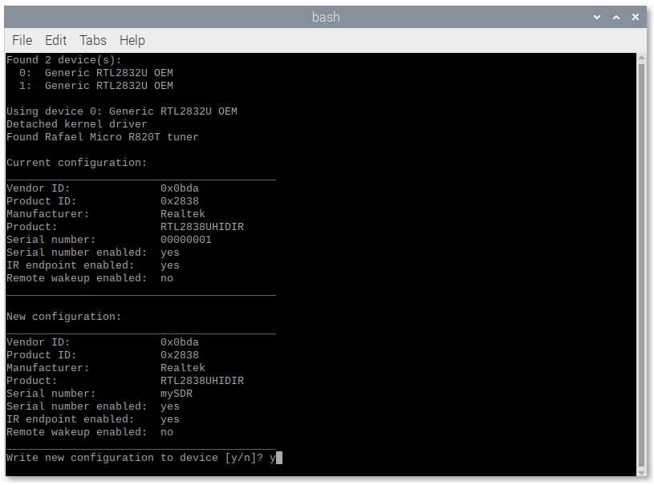

Calibrate devices
*****************

Every SDR device will have a small frequency error as it is cheaply mass produced and not tested for accuracy. This frequency error is linear across the spectrum, and can be adjusted in most SDR programs by entering a **PPM** (parts per million) offset value.

.. important::
	- PPM values have a tolerance of +/-7
	- PPM values can be negative
	- If you do not find the correct PPM you will not get AIS data
	- Some devices have a built-in temperature compensated oscillator (TCXO) that provides a PPM close to 0. These devices do not require calibration

If your device does not have TCXO, you need to know what its PPM value is, that is why we have added a tool to find it using GSM frequencies.

Before starting the calibration process, make sure there is an antenna connected to your device.

Go to |OPSDRcali| ``Calibration`` again, select the device and click ``Initial PPM`` to get an approach to your PPM value:

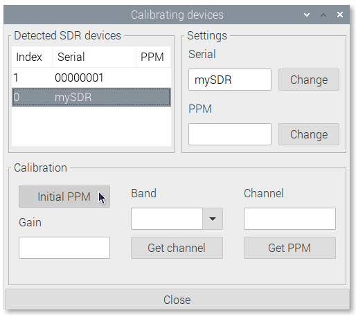

The PPM value will change with temperature, so let the device run for at least 30 minutes. The longer you let the program calculate the better result you will get. If you run the program for hours you will get almost the final PPM but if you do not have time just wait for the value to stabilize. 

Write down the stabilized PPM value and the maximum supported gain value for your device (usually 49.6).

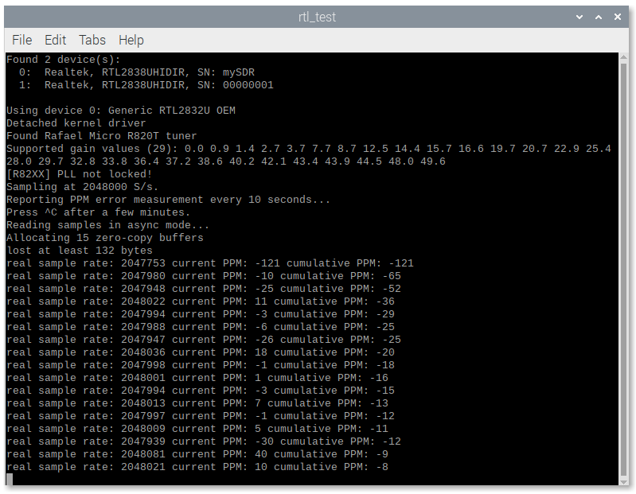

Close the program and put the PPM value in the *PPM* field and the maximum supported gain value in the *Gain* field.

Select the GSM *Band* for your zone and press ``Get channel``:

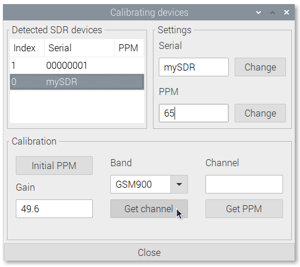
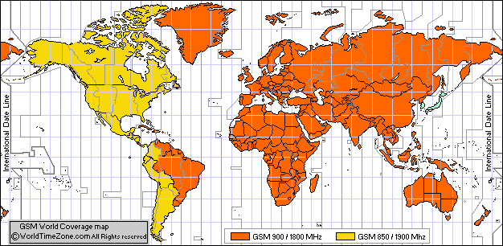

Write down the channel with the highest power value and close the window:

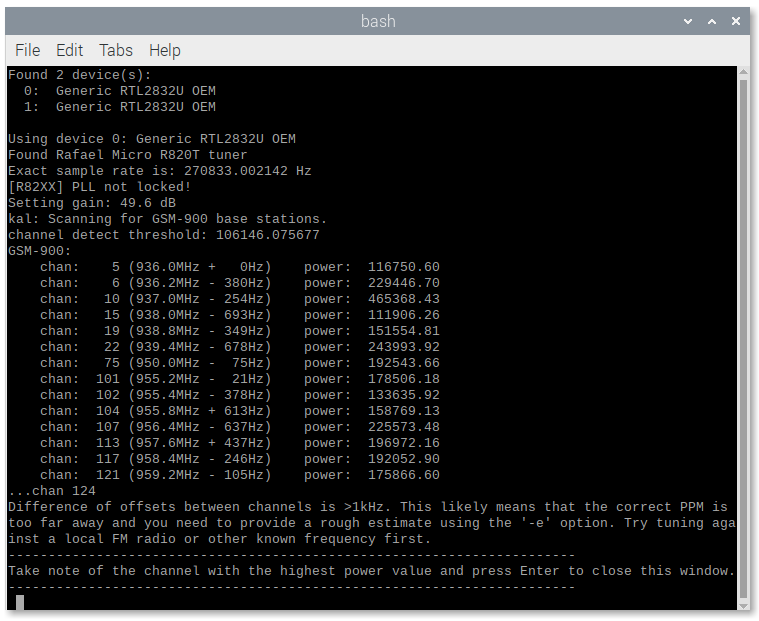

Put the strongest channel into *Channel* field and press ``Get PPM``:

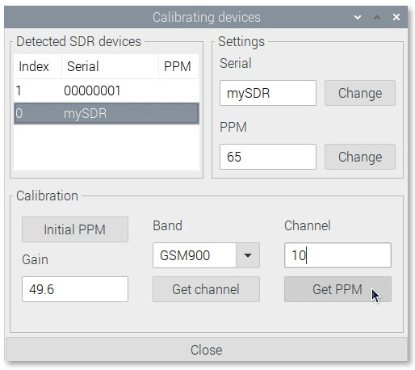

Write down the final PPM value and close the window:

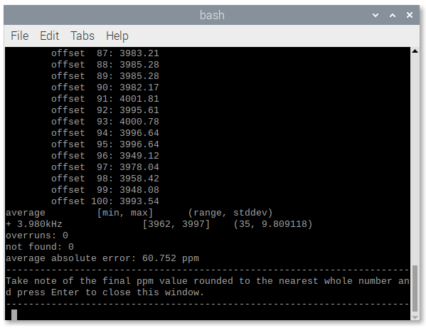

Put the final PPM into the *PPM* field without decimals rounding the value to the nearest integer number, click on ``Change`` and you are done:

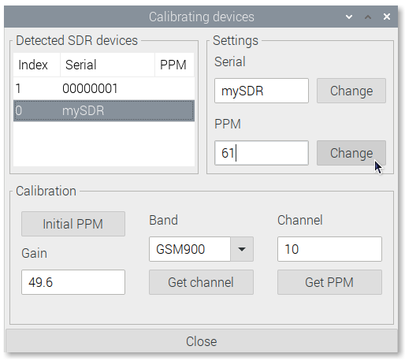
