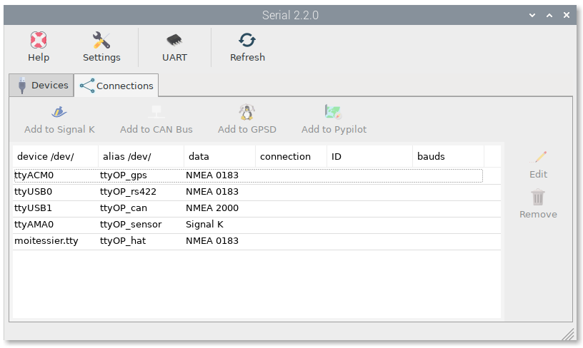
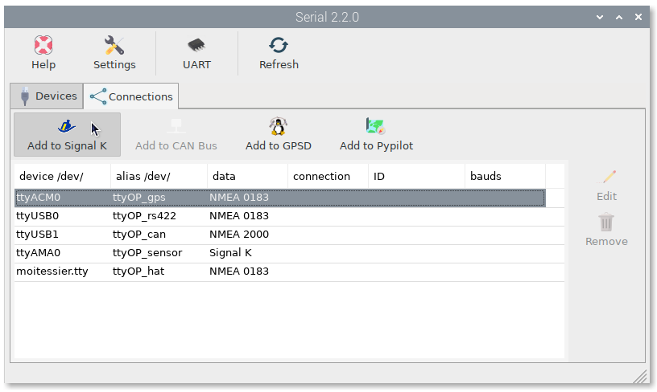
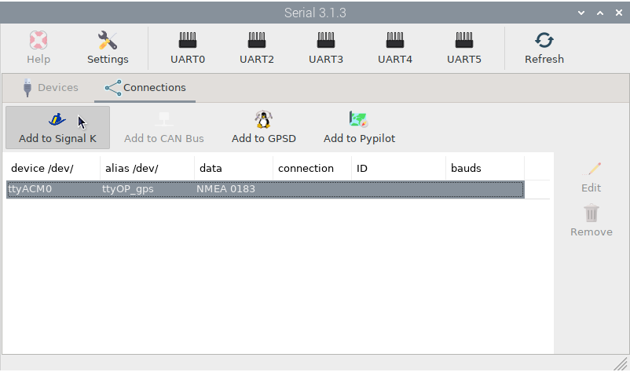
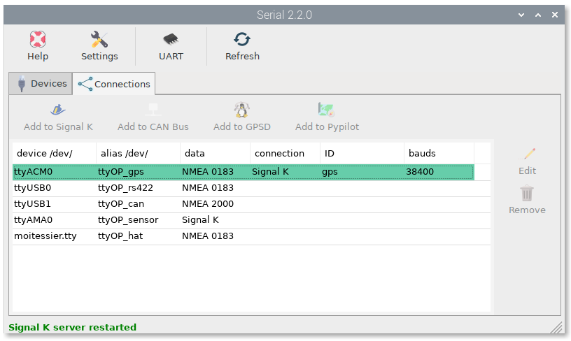
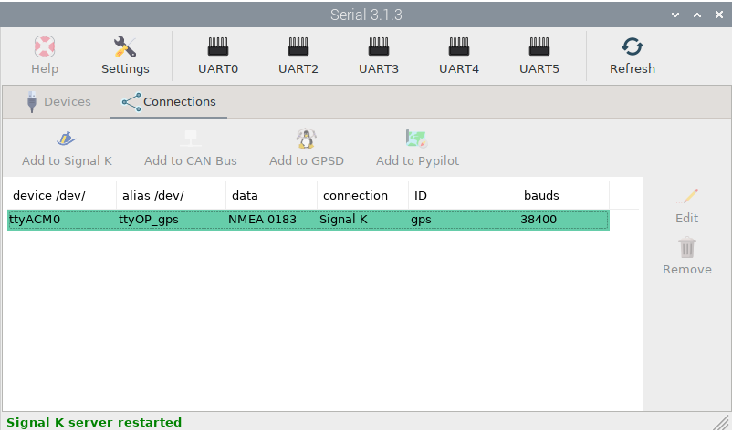

Connecting devices
##################

Using the ``Connections`` tab you can easily configure some programs to obtain data from your device:

Depending on the type of data you set when defining the alias, some supported programs will be enabled in the toolbar when selecting devices. To see how this works we are going to configure our USB GPS receiver. Select the ``ttyOP_gps`` device and press ``Add to Signal K``:

.. note::
	Select ``Add to Pypilot`` only if you are using a Pypilot controller. See :ref:`Pypilot<pypilot>` for more info.

	Select ``Add to GPSD`` only if you want GPSD to manage your GPS/AIS device. All GPSD and Signal K settings will be created automatically.

Then select the ``Baud Rate`` required by your device and press ``AUTO``:

The signal K server will restart and the connection will be marked green:

And you are done. Check in Signal K server the new connection:

And check OpenCPN to make sure there is a connection to the Signal K server:

.. image:: img/serial10.png
