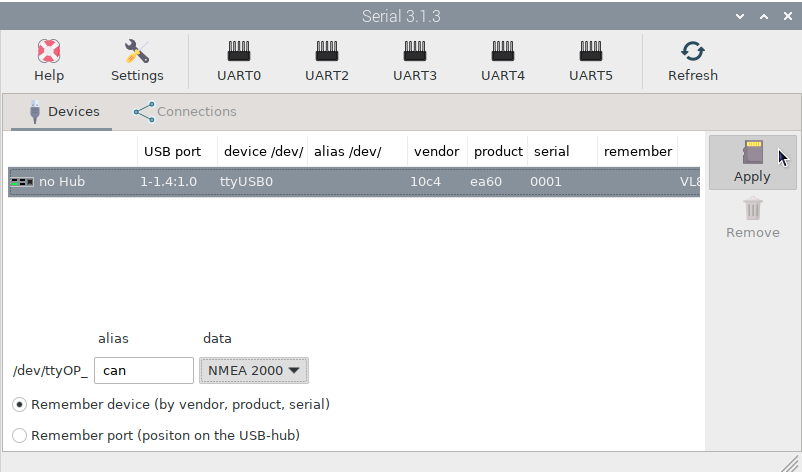
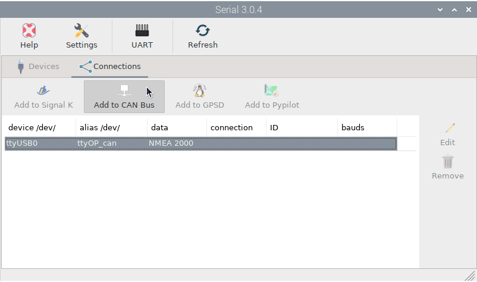
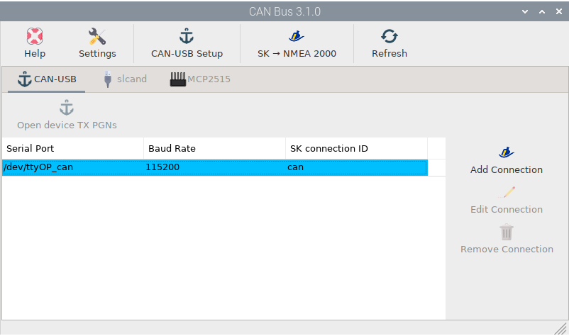

.. _serialCAN:

.. |OPserialApply| image:: img/apply.png
.. |OPserialConnections| image:: img/connections.png

.. |OPserialOP24| image:: img/openplotter-24.png

Connecting a USB CAN converter
##############################

This tutorial is for any NMEA 2000 converter that can connect via USB such as the *Actisense NGT-1*, the *OpenMarine CAN-USB Stick* (discontinued) and any *slcand* device.

To get data from your NMEA 2000 network you have to select the device, enter an ``alias`` and *select NMEA 2000* in ``data`` field. Finally press |OPserialApply| ``Apply`` and the device will be marked blue:

.. image:: img/serialCan2.png

Then go to |OPserialConnections| ``Connections`` tab, select the device and click |OPserialCan| ``Add to CAN Bus``:

.. image:: img/serialCan4.png

If you are using a *slcand* device click on ``MANUAL`` and go to :ref:`Input data by slcand<slcand>` chapter to learn how to configure these devices.

If you are using an *Actisense NGT-1* or an *OpenMarine CAN-USB Stick* device (discontinued), select the ``Baud Rate`` (usually 115200) and click on ``AUTO``.

The device will be marked blue and you are done:

.. image:: img/serialCan5.png

Open the |OPserialCan| *OpenPlotter CAN Bus* app to confirm that the device has been added to the |OPserialOP24| ``CAN USB`` tab:

And go to Signal K server to confirm that the connection has been made:

.. image:: img/serialCan7.png

Check OpenCPN to make sure there is a connection to the Signal K server and you are getting data from your NMEA 2000 network:

.. image:: ../img/opencpnConnection.png

.. note::
	To learn how to send data through your NMEA 2000 converter, see the chapter :ref:`Output data<CANout>`.

