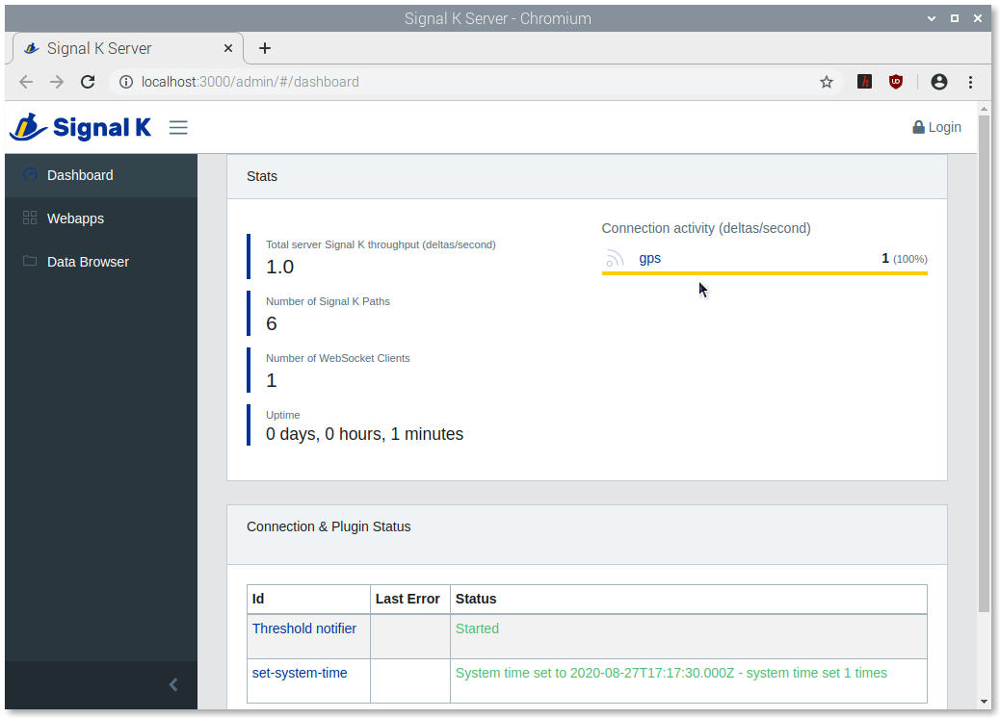

.. _connectingGPS:

.. |OPserialSK| image:: img/sk.png

.. |OPserialApply| image:: img/apply.png
.. |OPserialRefresh| image:: img/refresh.png
.. |OPserialConnections| image:: img/connections.png
.. |OPserialUSB| image:: img/usb.png

Connecting a USB GPS receiver
#############################

To see how this all works, we are going to configure the most basic device, a USB GPS receiver. In |OPserialUSB| ``Devices`` tab, select the device and enter a name for it in the ``alias`` field. Select the type of ``data`` that flows through the device (NMEA 0183 in this case) and finally select whether the system should ``remember the device`` or the position of the USB port where the device is plugged in.

.. image:: img/serial4.png

Press |OPserialApply| ``Apply`` when done and the device will be marked green:

.. image:: img/serial5.png

Unplug the device and press |OPserialRefresh| ``Refresh`` to check if the system detects the lost device:

.. image:: img/serial6.png

Plug the device back in, press |OPserialRefresh| ``Refresh`` and you are ready to configure any program using your device's alias and be sure it will always work. 

To send data from the USB GPS to OpenCPN, you need to first connect the device to the Signal K server and then connect OpenCPN to the Signal K server. In |OPserialConnections| ``Connections`` tab, select the *ttyOP_gps* device and press |OPserialSK| ``Add to Signal K``:

.. image:: img/serial7.png

Then select the ``Baud Rate`` required by your device and press ``AUTO``:

.. image:: img/serial8.png

The signal K server will restart and the connection will be marked green:

.. image:: img/serial9.png

And you are done. Check in Signal K server the new connection:

And check OpenCPN to make sure there is a connection to the Signal K server:

.. image:: ../img/opencpnConnection.png

.. note::
	Select |OPserialGpsd| ``Add to GPSD`` only if you want GPSD to manage your GPS/AIS device. All GPSD and Signal K settings will be created automatically.
