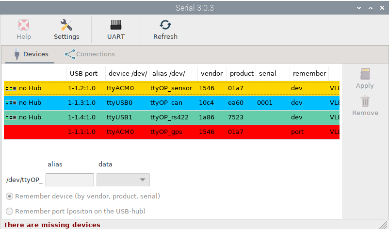
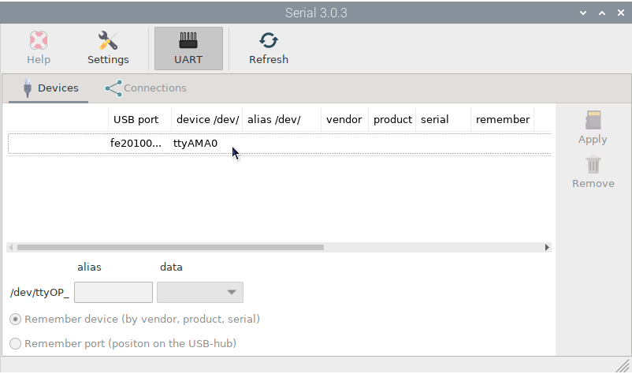
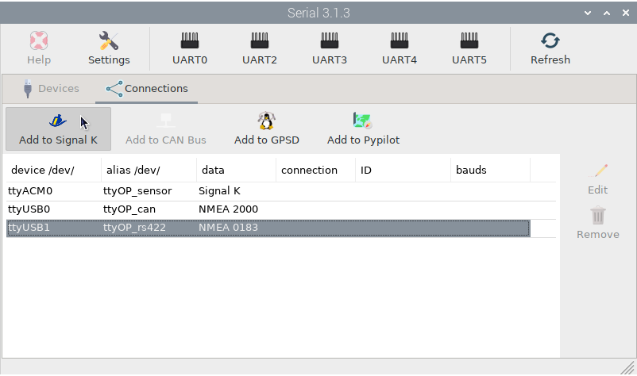
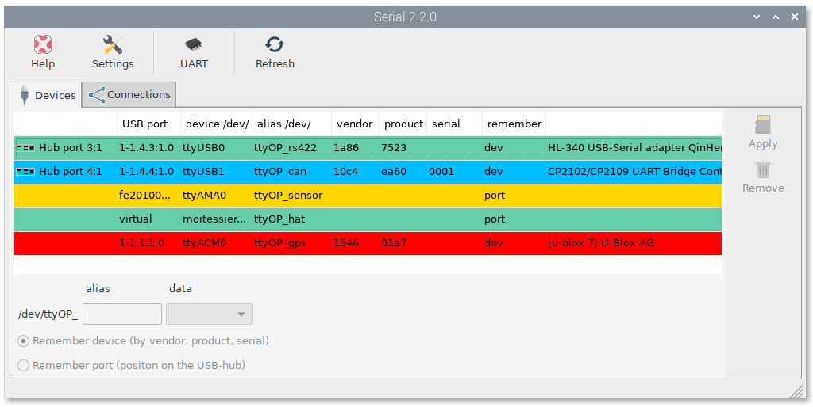
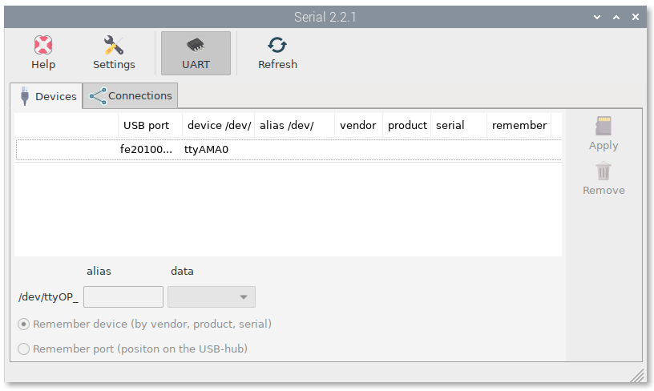

Setting devices
###############

When you connect a USB device or any serial device to Linux, it is named as: /dev/ttyUSB0, /dev/ttyACM0, /dev/ttyS1... If any program needs to get data from this device, you have to provide this name in the settings of the program. But there is a problem, this name is not tied to your physical device, so it could be that the system gives it a different name on the next reboot and your program points to a wrong name.

This ``Serial`` app allows you to define an alias for your device that will always be tied to it and will facilitate the configuration of some programs to obtain data from it.

This app will detect any serial device connected to the system. Press ``Refresh`` when connecting or disconnecting a device to update the list of detected devices.

In the image below you can see some devices in different colors:

:white: not set
:green: set as NMEA 0183
:blue: set as NMEA 2000
:yellow: set as Signal K
:red: the device is missing

To see how this works we are going to configure a USB GPS receiver. Select the device and enter a name for it in the ``alias`` field. Select the type of data that flows through the device (NMEA 0183 in this case) and finally select whether the system should remember the device or the position of the USB port where the device is connected.

You should use ``Remember port`` only if 2 or more of your devices have the same vendor, product and serial or if they do not have any of these identifiers at all. For Raspberry Pi, the first column in the list will show you which USB port your device is connected to and if you are using a HUB.

Press ``Apply`` when done and the device will be marked green:

Unplug the device and press ``Refresh`` to check if the system detects the lost device:

Plug the device back in, press ``Refresh`` and you are ready to configure any program using your device's alias and be sure it will always work. The next chapter will teach you how to configure the devices in some programs automatically.

**UART**

In Raspberry Pi 3 and 4 the Bluetooth interface and the UART interface share GPIO pins (GPIO14 for TXD0 and GPIO15 for RXD0). Bluetooth is enabled and UART is dissabled by default. If you want to connect a serial device to UART you need to disable Bluetooth and enable UART. Press ``UART`` and after reboot, UART interface will be enabled, Bluetooth will be disabled and you will see a new ``ttyAMA0`` device:

.. note::
	If you want to connect a Pypilot motor controller, you do not need to set an alias for ``ttyAMA0`` because Pypilot will detect the controller automatically. See :ref:`Pypilot<pypilot>` for more info.
