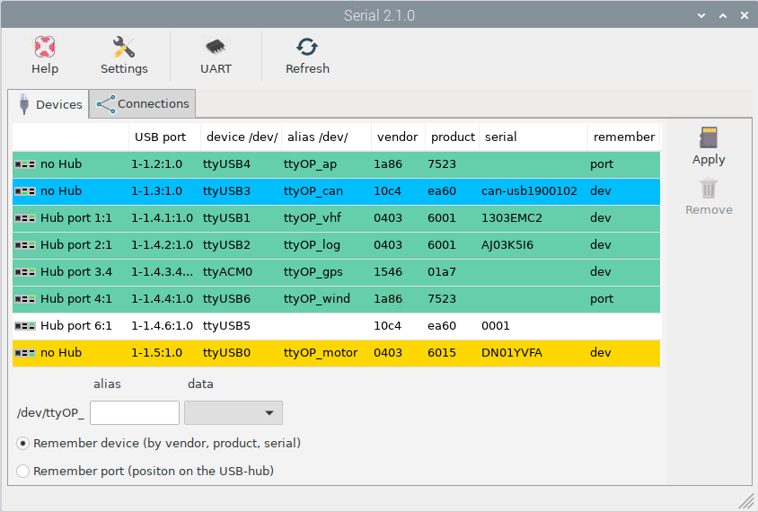
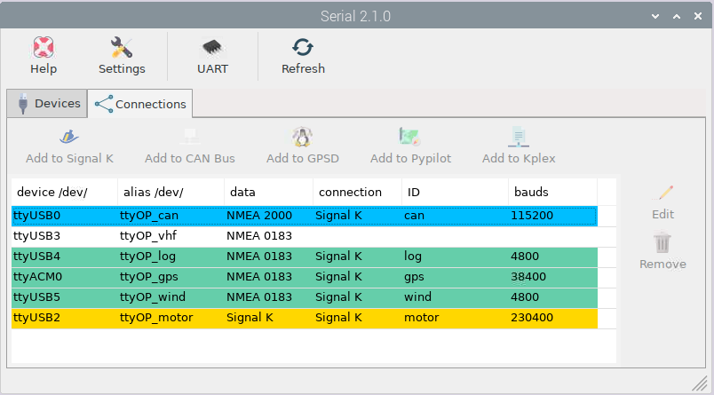

Serial app
##########

.. danger::
	Many devices use a serial protocol. They are named as:

	/dev/ttyUSB0 ...
	
	/dev/ttyACM0 ...
	
	/dev/ttyS1 ...

	Don't use these Linux names! They are not tied to a physical device!

The automatic port naming in Linux isn't good enough for marine apps.

In Signal K web admin you have 5 chances to select a serial port.

* Enter manually
* Openplotter managed
* by-id
* by-path
* Listed

.. image:: img/SK_Connection_Serial.png

You don't need this app if you feel fine with selecting a serial port by-id or by-path.

With this app you can give your serial port a name. And if it is usb related the app does show you on what usb port you connected the device.

Page "Devices"
**************

In this picture you see the different colors:

* green  -> NMEA 0183
* blue   -> NMEA 2000
* yellow -> Signal K
* red    -> the device is missing

You also see that if a port has same vendor number, same product number and same serial number (or no serial number) that you have to choose "Remember port").

.. warning::
	When you have to choose "Remember port" usb plug & play is disabled for these ports! You shouldn't change usb ports anymore.

Visual usb port icons
*********************

For raspberry pi the icon shows you the port where your device or hub is connected to.

Edit
****

When you doubble click on a line you can edit the name, the data type and the remember setting.

Page "Connections"
******************

Only "Add to GPSD" is really needed. Signal K, Pypilot and Kplex can be configured in their own OpenPlotter apps / Signal K web app. The task of this page is more to provide an overview.

Here you can select a device. The allowed connect icons will be active.

Add to Signal K

You are asked to setup the connection in Signal K MANUAL (recommended) or AUTO.

On MANUAL you will be forwarded to Signal K web admin.
On AUTO you only have to select the Baud Rate.

The edit button will bring you in the Signal K web admin (We recommend using the good Signal K web admin interface.)

"UART" button
*************

If you really know what you are doing with gpio ttl (GPIO14 TXD0 and GPIO15 RXD0) you can use: 

* enable UART  This disables the raspberry pi bluetooth serial port and enables the serial gpio ttl
* disable UART  This enables the raspberry pi bluetooth serial port (default)
