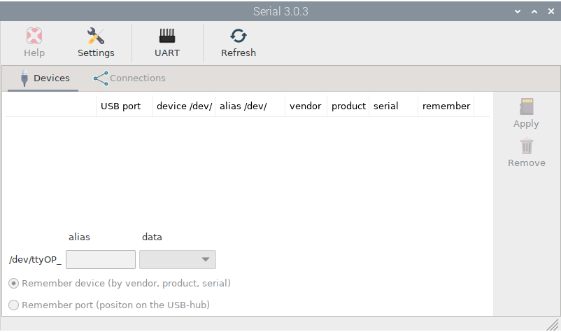

.. |mhelp| image:: ../img/help.png
.. |mSettings| image:: ../img/settings.png

.. |OPserialUart| image:: img/uart.png
.. |OPserialConnections| image:: img/connections.png
.. |OPserialRefresh| image:: img/refresh.png
.. |OPserialUSB| image:: img/usb.png
.. |OPserialPort| image:: img/rpi_port_4ur.png

|OPserialDevices| Managing serial devices
#########################################

.. note::
	To run this app type this in a terminal:

	.. parsed-literal::

		openplotter-serial

|mhelp| ``Help`` opens an offline copy of this documentation in a browser and |mSettings| ``Settings`` opens the main app *OpenPlotter Settings*.

When you connect a USB device or any serial device to Linux, it is named as: /dev/ttyUSB0, /dev/ttyACM0, /dev/ttyS1... If any program needs to get data from this device, you have to provide this name in the settings of the program. But there is a problem, this name is not tied to your physical device, so it could be that the system gives it a different name on the next reboot and your program points to a wrong device. This *OpenPlotter Serial* app allows you to define an alias for your device that will always be tied to it even after unplugging it.

This app will detect any serial device connected to the system. Press |OPserialRefresh| ``Refresh`` when plugging or unplugging a device to update the list of detected devices.

On the |OPserialUSB| ``Devices`` tab, you can define your devices by providing the alias, defining the type of data this device manages, and choosing how this device should be remembered: by its vendor, product, and serial number, or by the port where it is plugged in.

You should use ``Remember port`` only if 2 or more of your devices have the same vendor, product and serial or if they do not have any of these identifiers at all. For Raspberry Pi, the first column in the list will show you which USB port your device is connected to |OPserialPort| and if you are using a HUB.

Devices are marked in different colors:

:white: not defined yet.
:green: defined as NMEA 0183 device.
:blue: defined as NMEA 2000 device.
:yellow: defined as Signal K device.
:red: the device is missing.

.. image:: img/serial1.png

Using the |OPserialConnections| ``Connections`` tab you can easily configure some programs to obtain data from your device. Depending on the type of data you set when defining the alias, some supported programs will be enabled in the toolbar when selecting devices. 

.. image:: img/serial3.png

In the rest of this section, you will learn how to define and connect different devices using examples.

In Raspberry Pi 3 and 4 the Bluetooth interface and the UART interface share GPIO pins (GPIO14 for TXD0 and GPIO15 for RXD0). Bluetooth is enabled and UART is dissabled by default. If you want to connect a serial device to UART you need to disable Bluetooth and enable UART. Press |OPserialUart| ``UART`` and after reboot, UART interface will be enabled, Bluetooth will be disabled and you will see a new ``ttyAMA0`` device:

.. image:: img/serial2.png
