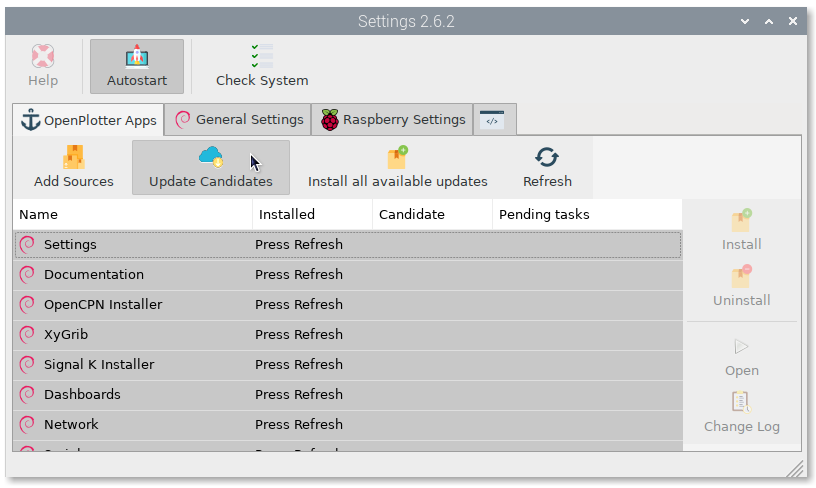
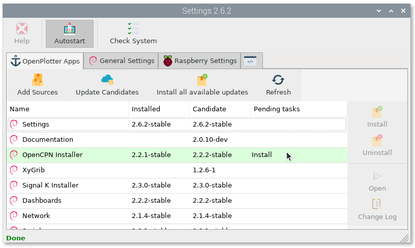
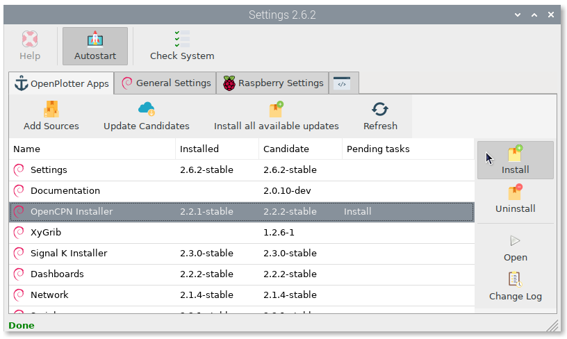
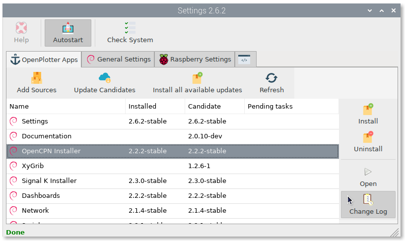

.. _settings:

.. |opsettings| image:: img/openplotter-settings.png

|opsettings| OpenPlotter Settings
#################################

This is the main OpenPlotter app. You need it to install the rest of the apps. If you are using any of the OpenPlotter images for Raspberry Pi, the sources for the repositories where the OpenPlotter apps live will be installed and working, but if you are installing OpenPlotter from scratch you will see something like this:

.. image:: img/settings1.png

.. |appssources| image:: img/sources.png
.. |appcandidates| image:: img/update.png
.. |mout| image:: img/output.png

To install the sources, click |appssources| ``Add sources`` and then click |appcandidates| ``Get Candidates``. You will see the result of each process in the |mout| output tab. After adding the sources you are ready to install the rest of the apps:

.. image:: img/settings2.png

.. |mhelp| image:: img/help.png
.. |mautostart| image:: img/autostart.png
.. |mcheck| image:: img/check.png

|mhelp| Help
************

This button will be disabled until you install the *Documentation* app. After installation, the button will be enabled and clicking on it will open an offline copy of this documentation in a browser.

|mautostart| Autostart
**********************

This button should always be checked. Allows self-diagnosis at startup of all OpenPlotter apps and some important settings. It will also trigger some programs and tools configured to run at startup.

|mcheck| Check System
*********************

By clicking this button, you can run the self-diagnosis at any time. Each OpenPlotter app installed will add new processes to diagnose its operation. If something does not work as expected, a red message will show the problem and the solution:

.. image:: img/settings4.png

.. |opapps| image:: img/openplotter-24.png
.. |gsettings| image:: img/debian.png
.. |rsettings| image:: img/rpi.png
.. |slog| image:: img/log.png

|opapps| OpenPlotter Apps
#########################

**Version numbering**

OpenPlotter apps versions consist of 3 digits separated by periods (a.b.c), a code name and a state:

:a: This is the OpenPlotter version the app belongs. This value will change only when a new Debian version is released.
:b: This value will change when major updates like new features have been added.
:c: This value will change when minor updates like fixed bugs or translations have been added.
:codeName: Name to identify the OpenPlotter version (a).
:state: dev, beta or stable.

.. |apprefresh| image:: img/refresh.png
.. |appinstall| image:: img/install.png
.. |appuninstall| image:: img/uninstall.png
.. |appopen| image:: img/open.png
.. |appchanges| image:: img/changelog.png

|appssources| Add sources
*************************

|appcandidates| Get Candidates
******************************

Occasionally, you should check if there are new versions of OpenPlotter apps to enjoy new features and correct errors. Click on ``Update Candidates``

|apprefresh| Refresh
********************

|appinstall| Install
********************

Available updates will be marked with green background. Select the app you want to update and click on ``Install``

If the updated apps were running while the installation, you will have to close and open them again to see changes.

|appuninstall| Uninstall
************************

|appopen| Open
**************

|appchanges| Change Log
***********************

If you want to know the changes in old and latest versions, select any app and click on ``Change Log``

|gsettings| General Settings
############################

.. image:: img/settings3.png

.. |GStranslate| image:: img/crowdin.png
.. |GSresize| image:: img/resize.png
.. |GSdelay| image:: img/delay.png
.. |GSplay| image:: img/play.png

|GStranslate| Language
**********************
|GSresize| Maximize
*******************
|GSdelay| Delay
***************
|GSplay| Play
*************

|rsettings| Raspberry Settings
##############################

.. |RSscreensaver| image:: img/screen.png
.. |RSgpio| image:: img/chip.png

|RSscreensaver| Screensaver
***************************
|RSgpio| GPIO Map
*****************

|slog| System log
#################

.. |SLbug| image:: img/bug.png
.. |SLall| image:: img/logsee.png
.. |SLcat| image:: img/logcategory.png
.. |SLsearch| image:: img/logsearch.png
.. |SLdelete| image:: img/logremove.png

|SLbug| Debugging
*****************
|SLall| See all
***************
|SLcat| See category
********************
|SLsearch| Search
*****************
|SLdelete| Delete all
*********************