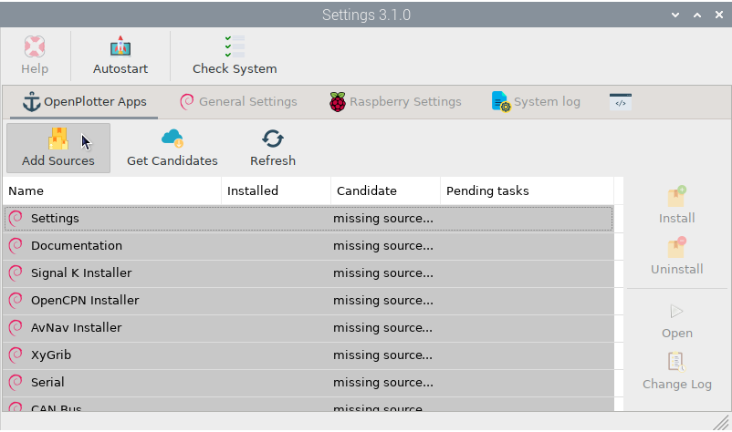
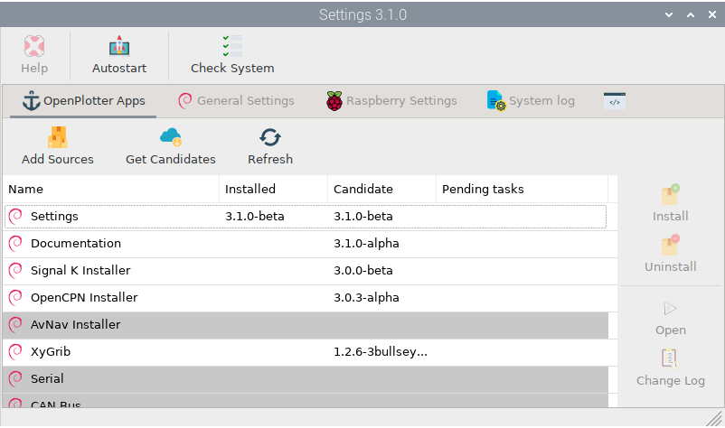
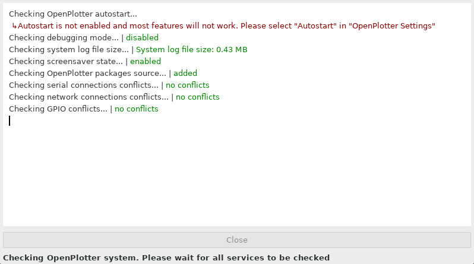
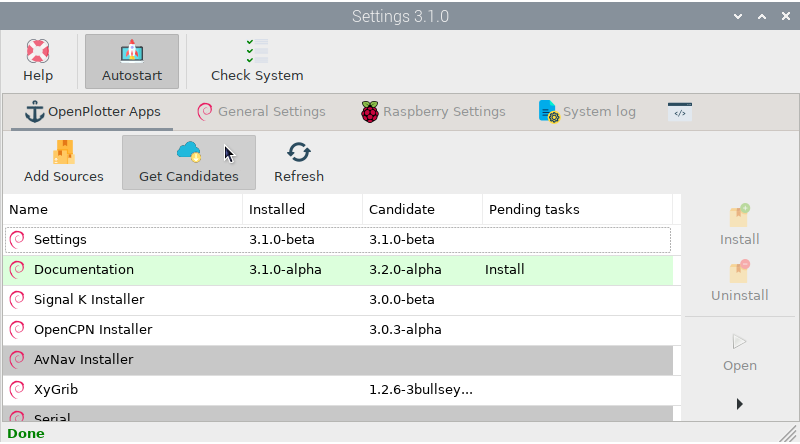
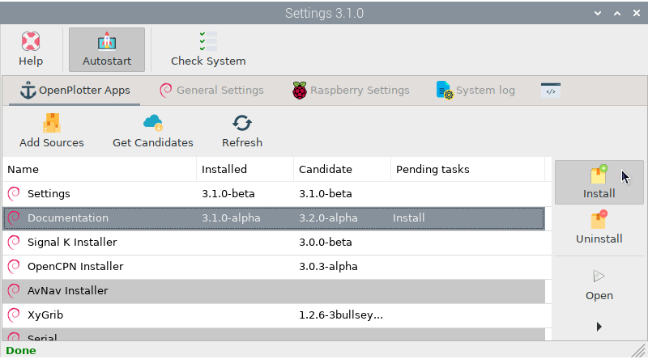
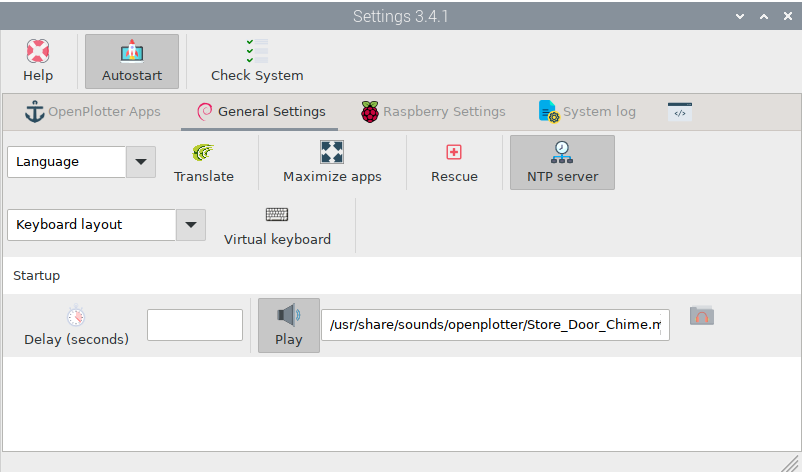
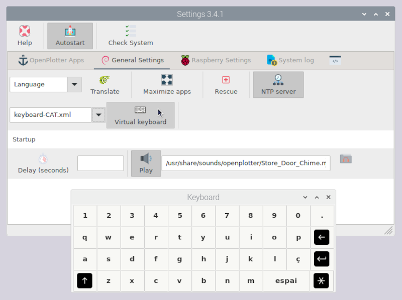
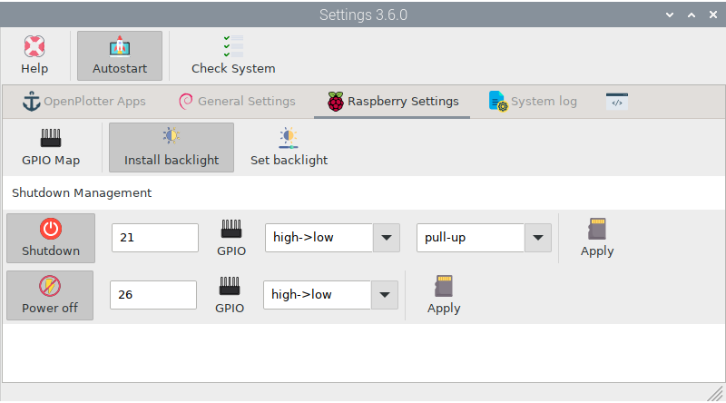
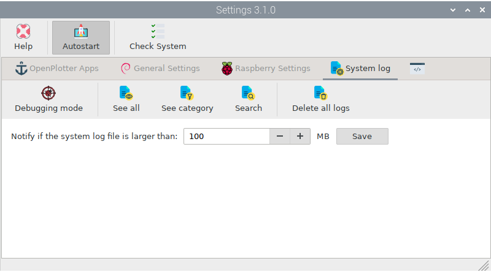

.. _settings:

.. |opsettings| image:: img/openplotter-settings.png
.. |appssources| image:: img/sources.png
.. |appcandidates| image:: img/update.png
.. |mout| image:: img/output.png
.. |mhelp| image:: ../img/help.png
.. |mautostart| image:: img/autostart.png
.. |mcheck| image:: img/check.png
.. |GSrescue| image:: img/rescue.png
.. |opapps| image:: img/openplotter-24.png
.. |gsettings| image:: img/debian.png
.. |rsettings| image:: img/rpi.png
.. |slog| image:: img/log.png
.. |apprefresh| image:: img/refresh.png
.. |appinstall| image:: img/install.png
.. |appuninstall| image:: img/uninstall.png
.. |appopen| image:: img/open.png
.. |appchanges| image:: img/changelog.png
.. |GStranslate| image:: img/crowdin.png
.. |GSresize| image:: img/resize.png
.. |GSdelay| image:: img/delay.png
.. |GSplay| image:: img/play.png
.. |GSfile| image:: img/file.png
.. |GSkeyboard| image:: img/keyboard.png
.. |GStouch| image:: img/touchscreen.png
.. |RSscreensaver| image:: img/screen.png
.. |RSgpio| image:: img/chip.png
.. |RSshutdown| image:: img/shutdown.png
.. |RSpoweroff| image:: img/poweroff.png
.. |RSapply| image:: img/apply.png
.. |RSbrightness| image:: img/brightness.png
.. |RSbrightnessInstall| image:: img/brightness-install.png
.. |SLbug| image:: img/bug.png
.. |SLall| image:: img/logsee.png
.. |SLcat| image:: img/logcategory.png
.. |SLsearch| image:: img/logsearch.png
.. |SLdelete| image:: img/logremove.png
.. |OPnotifications| image:: img/notifications.png

|opsettings| OpenPlotter Settings
#################################

.. note::
	To run this app type this in a terminal:

	.. parsed-literal::

		openplotter-settings

This is the main OpenPlotter app. You need it to install the rest of the apps. If you are using any of the OpenPlotter images for Raspberry Pi, the sources for the repositories where the OpenPlotter apps live will be installed and working, but if you are installing OpenPlotter from scratch you will see something like this:

To install the sources, click |appssources| ``Add sources`` and then click |appcandidates| ``Get Candidates``. You will see the result of each process in the |mout| output tab. After adding the sources you are ready to install the rest of the apps:

|mhelp| Help
************

This button will be disabled until you install the *Documentation* app. After installation, the button will be enabled and clicking on it will open an offline copy of this documentation in a browser.

|mautostart| Autostart
**********************

.. important::
	This button should always be checked.

Allows self-diagnosis at startup of all OpenPlotter apps and some important settings. It will also trigger some programs and tools configured to run at startup.

|mcheck| Check System
*********************

By clicking this button, you can run the self-diagnosis at any time. Each OpenPlotter app installed will add new processes to diagnose its operation. If something does not work as expected, a red message will show the problem and the solution:

This process runs automatically at startup and it is also the time when some important internal OpenPlotter processes are started. OpenPlotter is highly configurable and some parameters can produce unexpected effects such as data loops, unstable or even unusable systems. By clicking |GSrescue| ``Rescue`` you can prevent these processes from starting in order to modify the settings and recover the system. 

|opapps| OpenPlotter Apps
#########################

OpenPlotter apps versions consist of 3 digits separated by periods (a.b.c), a code name and a development state:

:a: This is the OpenPlotter version the app belongs. This value will change only when a new Debian version is released.
:b: This value will change when major updates like new features have been added.
:c: This value will change when minor updates like fixed bugs or translations have been added.
:codeName: Name to identify the OpenPlotter version (a).
:state: **Alpha**: new features need to be added; **Beta**: all features have been added, but need to be tested; **Stable**: all functions should work properly.

|appssources| Add sources
*************************

The sources of the OpenPlotter apps repositories should be added once at the beginning and then only if you see the *missing source* message in any of the OpenPlotter apps.

|appcandidates| Get Candidates
******************************

Occasionally, you should check if there are new versions of OpenPlotter apps in the remote repositories to enjoy new features and correct errors. If there is a new version of an installed app, it will be shown in green:

|apprefresh| Refresh
********************

Run this option when you want to know the status of your apps. This option only compares versions locally and checks for pending tasks. To compare versions in the remote repositories click |appcandidates| ``Get Candidates``.

|appinstall| Install
********************

To install a new version of any app select the item in the list and click this button. If the updated app was running while the installation, you will have to close and open it again to see changes.

.. note::
	It is highly recommended to install and update the OpenPlotter apps from *OpenPlotter Settings* because often the installation process involves extra changes to the system that will be carried out automatically. If you install the apps manually from a terminal or they are updated automatically due to a general system update, they will be marked in pink to indicate that there are pending actions:

	.. image:: img/settings7.png

	These extra actions will be executed the first time you open the app:

	.. image:: img/settings8.png

|appuninstall| Uninstall
************************

To uninstall any app select the item in the list and click this button. It is also important to uninstall OpenPlotter apps from *OpenPlotter Settings* to undo the changes in the system.

|appopen| Open
**************

If you have trouble locating and opening the OpenPlotter apps installed on your system, you can open them from here.

|appchanges| Change Log
***********************

Select any app and click this button to see all changes across versions.

|gsettings| General Settings
############################

|GStranslate| Language
**********************

You can select any of the available languages and all OpenPlotter apps will be translated the next time you open them. You can help us with translations by clicking |GStranslate| ``Translate``.

|GStouch| Touchscreen
*********************

After enabling this setting, most programs will display monster scrolls better for sailors' fingers and some programs like OpenCPN will be optimized for touchscreens.

|GSresize| Maximize
*******************

If you enable this option, all OpenPlotter applications will be maximized the next time you open them.

|GSrescue| Rescue
*****************

Here you can enable/disable the *Rescue* mode to help recover unstable systems due to some misconfigurations. For example if you set an action to reboot the system using the *OpenPlotter Notifications* app in response to some value of Signal K, it can cause a reboot loop. Using the *Rescue* mode disables all actions temporarily and you will be able to remove that killer setting.

|GSkeyboard| Virtual keyboard
******************************

OpenPlotter includes a virtual keyboard for touch systems or systems that do not have a physical keyboard. You can customize your virtual keyboard by creating a layout that suits your requirements and your language.

.. note::
	Visit this `link <https://forum.openmarine.net/showthread.php?tid=4070>`_. to know how to create and share a keyboard layout.

|GSdelay| Delay
***************

Sometimes you may need some devices or programs to be ready before they work normally. Adding seconds to this field and enabling this button will add a delay to the OpenPlotter startup process to allow time for these lazy devices or programs.

|GSplay| Play
*************

You can play a sound to notify you when the OpenPlotter startup process is complete. Select a sound by clicking |GSfile| and enable the |GSplay| ``Play`` button. This is especially useful for headless systems.

|rsettings| Raspberry Settings
##############################

|RSgpio| GPIO Map
*****************

Some apps will report which GPIO they are using and you can check it here. Checking a GPIO will return useful information about its usage.

.. image:: img/settings10.png

|RSbrightnessInstall| Install backlight
***************************************

Brightness on monitors that are connected via the DSI display port can be controlled by software. If you have a DSI touchscreens as the `official monitor for Raspberry Pi <https://www.raspberrypi.com/products/raspberry-pi-touch-display>`_ or any of `its clones <https://www.waveshare.com/8inch-DSI-LCD.htm>`_, you can install the necessary software to control brightness by clicking |RSbrightnessInstall| ``Install backlight`` button.

|RSbrightness| Set backlight
****************************

After installing the required software, you will have access to a graphical interface to set the brightness using a slider.

.. image:: img/setBacklight.png

If you have the |OPnotifications| *OpenPlotter Notifications* app installed, you will see a new actions added to the list to automatically set the backlight value upon receiving a specific notification:

.. image:: img/backlightAction.png

|RSshutdown| Shutdown
*********************

You can use any GPIO on the Raspberry to set a shutdown botton. Click |RSgpio| ``GPIO`` to choose a GPIO, usually GPIO 21 at pin 40. Select a GPIO ``Transition`` to trigger the shutdown, *high->low* or *low->high*. Select an internal pull resistor, *pull-up* and *pull-down*, or *off* if you use an external pull resistor. Click |RSapply| ``Apply`` to save settings and changes will be applied after the next reboot.

|RSpoweroff| Power off
**********************

You can use any GPIO on the Raspberry to notify an external circuit that it can safely cut power. Click |RSgpio| ``GPIO`` to choose a GPIO, usually GPIO 26 at pin 37. Select a GPIO ``Transition`` to trigger the power off, *high->low* or *low->high*. Click |RSapply| ``Apply`` to save settings and changes will be applied after the next reboot.

|slog| System log
#################

Here are some tools for debugging and troubleshooting your system. When an application malfunctions, it can generate excess messages and eventually create huge log files that consume all free storage space. By setting a maximum log file size, you can detect and resolve potential problems.

|SLbug| Debugging
*****************

When this button is enabled, OpenPlotter applications will generate error messages that will be saved to the log file or printed on the screen when the application is run from a terminal. Use this feature only to check for errors, do not forget to disable it later because it might slow down performance or lead to oversized log files.

|SLall| See all
***************

This button will print the full contents of the system log file in the |mout| output tab.

|SLcat| See category
********************

Here you can filter the contents of the system log file by some keywords.

|SLsearch| Search
*****************

Here you can filter the contents of the system log file by any term.

|SLdelete| Delete all
*********************

If after debugging the system the log file is too large here you can delete it to start from scratch on the next reboot.
