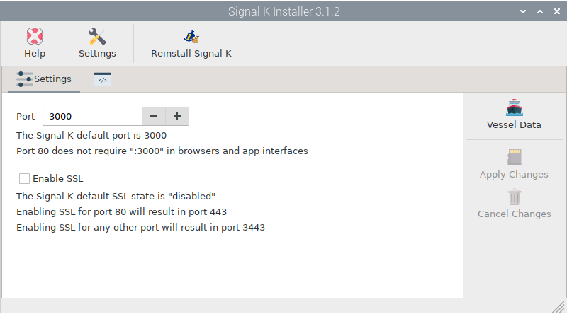
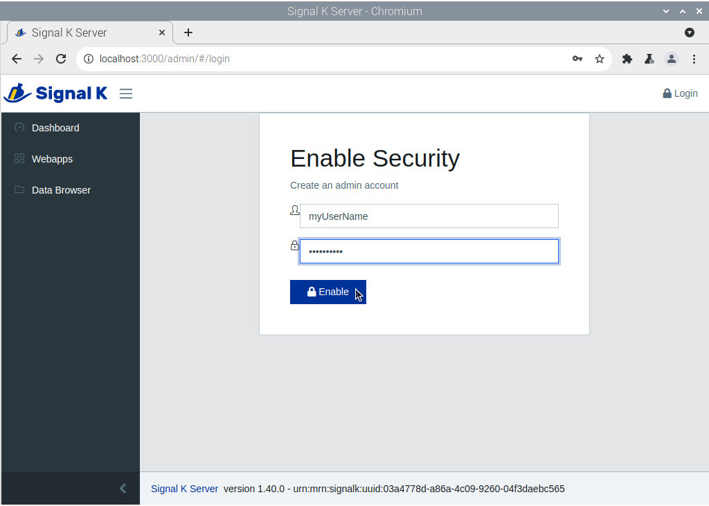
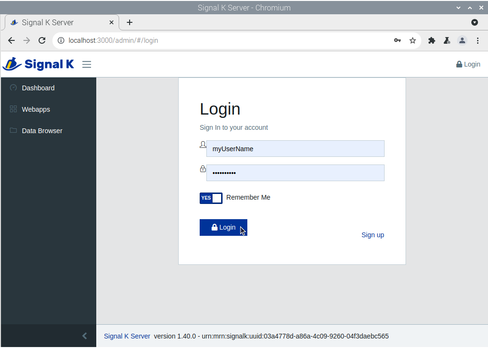
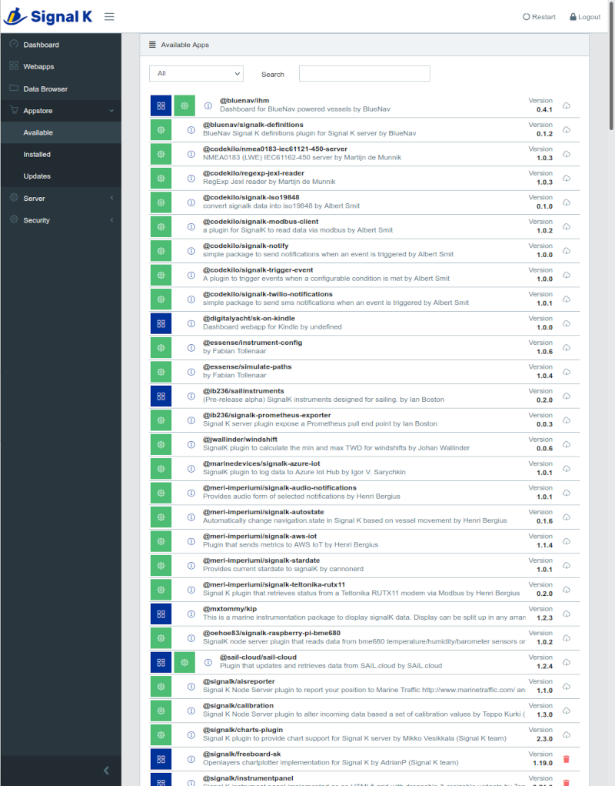

|OPsignalk| Signal K Installer
##############################

.. note::
	To run this app type this in a terminal:

	.. parsed-literal::

		openplotter-signalk-installer

.. |OPsignalkReinstall| image:: img/reinstall.png

.. |mhelp| image:: ../img/help.png
.. |mSettings| image:: ../img/settings.png

|mhelp| ``Help`` opens an offline copy of this documentation in a browser and |mSettings| ``Settings`` opens the main app *OpenPlotter Settings*.

|OPsignalkReinstall| Reinstall Signal K
***************************************

After installing *OpenPlotter Signal K Installer* app, the Signal K server should be also installed and you do not have to do anything else to start using it. We add this option in case you need to reinstall the server from scratch if it ever becomes unstable. 

.. caution::
	Reinstalling the signal K server will remove the current plugins, login credentials and settings.

|OPsignalkSettings| Settings
****************************
.. |OPsignalkApply| image:: img/apply.png
.. |OPsignalkCancel| image:: img/cancel.png

*OpenPlotter Signal K Installer* app installs the server using port 3000 by default. To access the web administration panel of the Signal K server, you can use this URL from the browser included in OpenPlotter:

.. parsed-literal::

	http://localhost:3000

Or this one from a browser running on any computer connected to the same network:

.. parsed-literal::

	http://openplotter.local:3000

If you set the port 80 instead the default port 3000, the URLs would be:

.. parsed-literal::

	http://localhost
	http://openplotter.local

You can change the port or enable SSL at any time without losing your current settings. Use |OPsignalkApply| ``Apply`` to save changes or |OPsignalkCancel| ``Cancel`` to reload current settings.

Click |OPsignalkVessel| ``Vessel Data`` to set some important data of your boat like name, MMSI, call sign, draft ... You need to login to access this section of the web administration panel.

Logging in
##########

When you first enter the Signal K web administration panel, it will ask you for a name and password to create an administrator account:

Once you do that you will be offered the login page:

The last menu item in the Signal K administrator is *Security*. You can add/delete users and change passwords there.

More info
#########

To know how data is managed in OpenPlotter you should read the chapter :ref:`How does it work?<howdoesItwork>` in the *Description* section.

On the `official Signal K <https://signalk.org/>`_ site you will find a lot of valuable information.

On the Signal K server `github page <https://github.com/SignalK/signalk-server/wiki>`_ you will also find some interesting information.

There are more than `150 plugins <https://www.npmjs.com/search?q=signalk-node-server-plugin>`_ and more than `40 apps <https://www.npmjs.com/search?q=signalk-webapp>`_ to extend the Signal K server features. Go to :menuselection:`Appstore --> Available` to install them:

