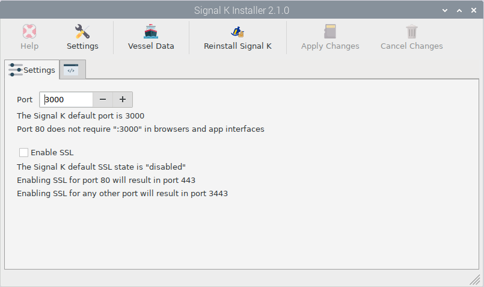

Signal K Installer
##################

This app helps you to:

* Reinstall Signal K
* To change the default port
* To enable/disable SSL

Usually this shouldn't be necessary.

* There is a link into the Signal K admin ui to the Vessel data (Name, MMSI, Length, ...) 

Signal K Security
#################

When you enter the Signal K admin ui, it will ask you for a name and a password to create an administrator account.
Once you do that you will be offered the login page.

The last menu item in the ui is security. You can add/delete users and change passwords ...

If you have lost the password
*****************************

You can reset Signal K security by:

1) Open a terminal
2) Delete the existing file: /home/pi/.signalk/defaults.json
3) Run the setup sudo signalk-server-setup. Accept the update option rather than configuring from scratch. Select no for port 80 and SSL
4) Navigate to the login page with a browser. Note that the option is now not to login but instead to create an administrator account. Once you do that you will be offered the login page.
