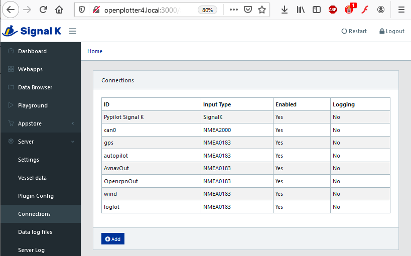
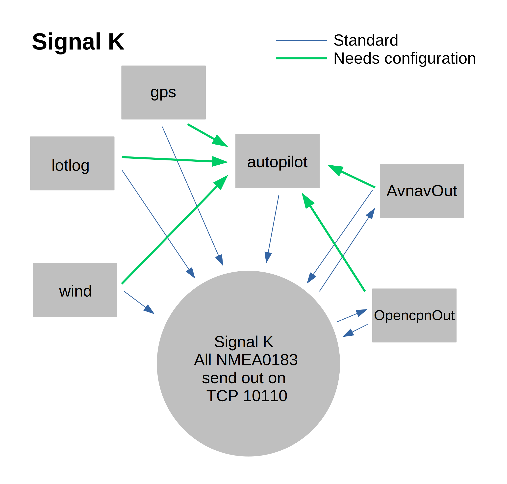
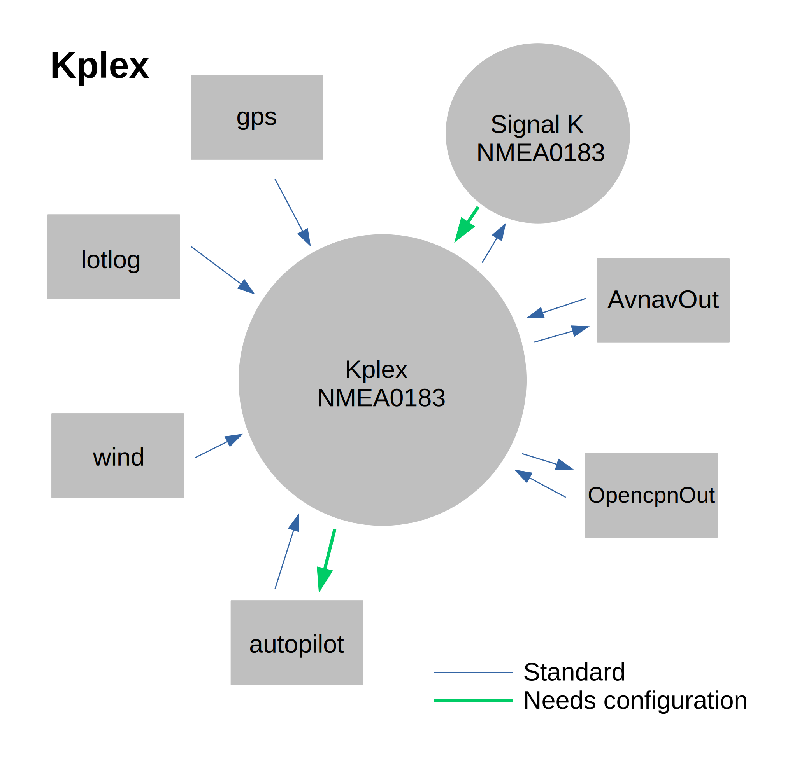
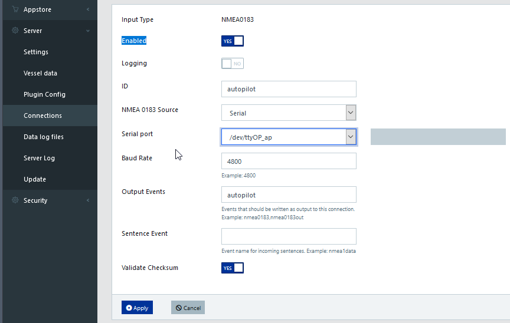
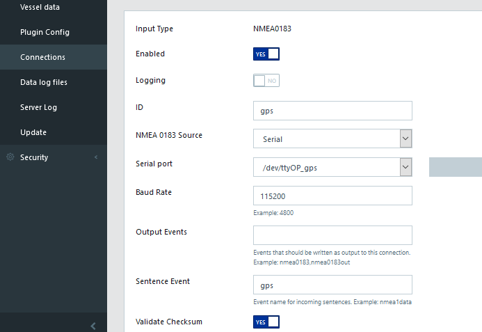
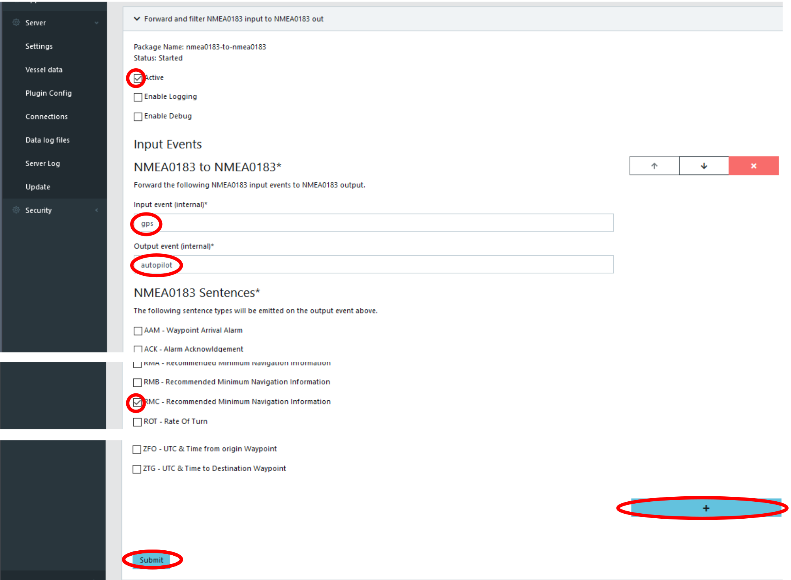
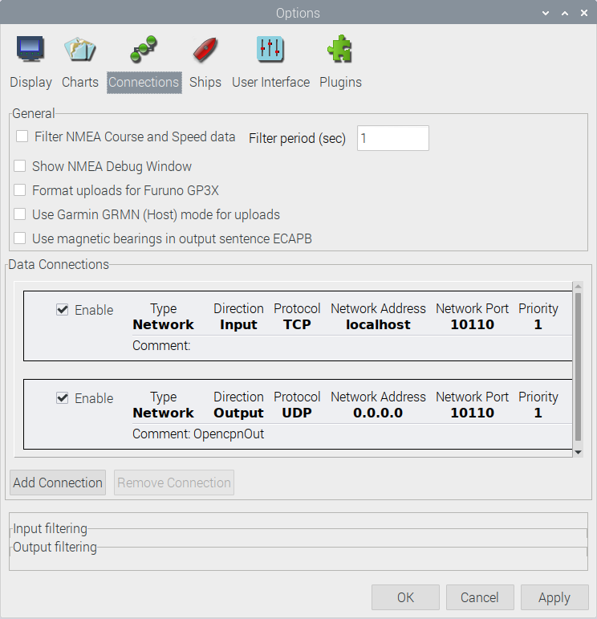
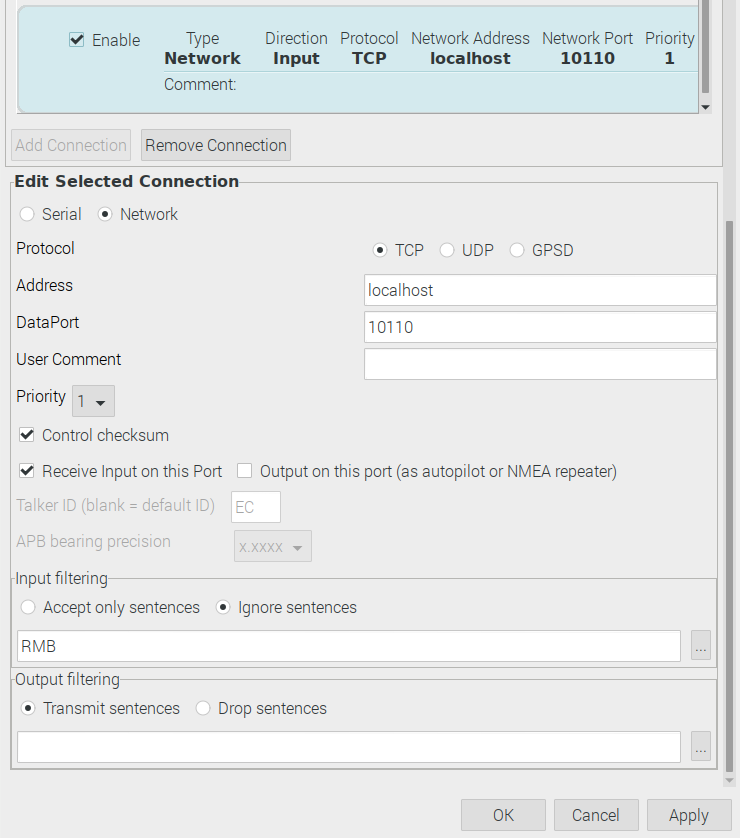
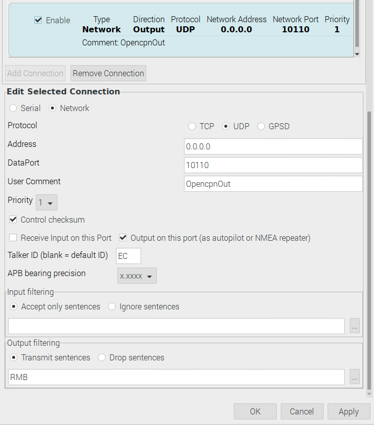

Signal K NMEA0183 multiplexing
##############################

It is important that you understand that Signal K (or optional Kplex) must drive all the NMEA data traffic to work properly, so you do not need to configure OpenCPN to get GPS signal.

Navigate to the Signal K admin ui with a browser (address localhost:3000).
The menu Server -> Connection brings you to the connection manager.

.. note::
	Every enabled NMEA0183 input will be send to TCP 10110. This is important for external devices or apps.
	
But what about the output to a serial port?
This is important for vhf radios, as they need gps coordinates and time or the autopilot to get data for the next waypoint.

In Signal K you can specify, which sentences should be send from a defined device to a defined device.
Here you see the main difference between Signal K and Kplex.

The green lines have to be configured. We will show this for Signal K step by step now.

Setup NMEA0183 autopilot
************************

(The connections as shown in the first picture have been done.)

We start with the receiver side of the autopilot connection

For easy handling of the receiver we recommend using the same name for ``Output Events`` as for the ``ID``.

The transmitter side looks nearly the same.

For easy handling of the transmitter we recommend using the same name for ``Sentence Event`` as for the ``ID``.

Now the ``Sentence Event`` must be set for OpencpnOut (optional for wind, lotlog, and AvnavOut).

nmea0183 to nmea0183 plugin
***************************

You should install this plugin from Signal K ``Appstore``. After a restart you will find it under ``Server -> Plugin Config -> Forward and filter NMEA0183 input to NMEA0183 out``.

For OpencpnOut click on the + button (marked red) and use OpencpnOut instead of gps. Select RMB sentence. Click Submit and restart.
(Optional do this for wind, ...  It is correct that you have a very long list.)

openCPN connection settings for autopilot
*****************************************

This settings are the standard settings for openCPN.

Picture: input and output overview

Picture: input

Picture: output

.. danger::
	If you don't filter RMB on input and only output RMB to Signal K. Everything seems OK until someone activates a course on openCPN. This will cause in a loop which lead to unpredictable behavior while sailing. So activate a course for the autopilot to check for loops before on sea.
	
(On the Signal K admin ui dashboard you can see the deltas/second. If they get very high you have a loop.)

OpencpnOut settings in Signal K connection should be:

.. image:: img/sk-ui-OpenplotterOut.png

Picture: Settings to receive the RMB sentence from openCPN

