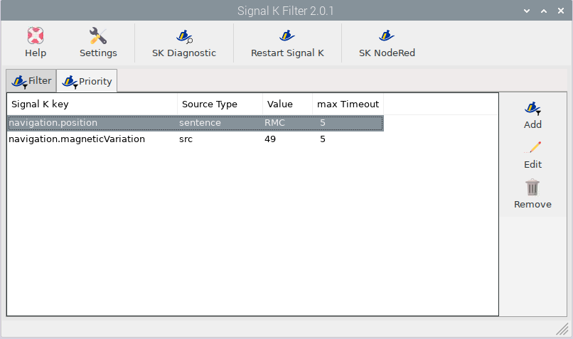
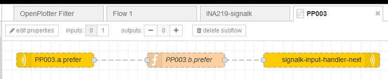
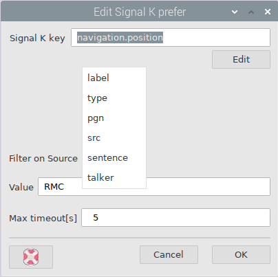
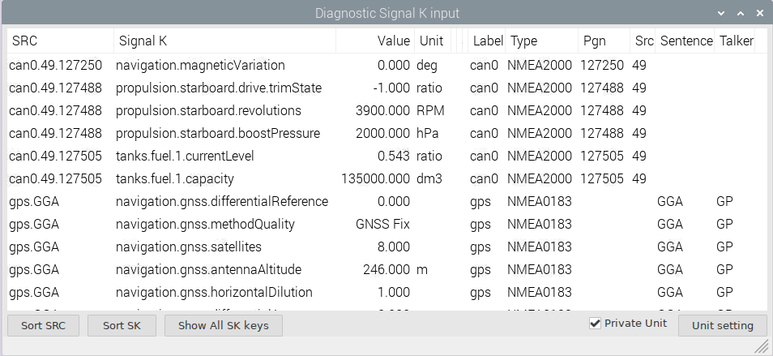

Signal K filter
###############

What is Signal K Filter?
************************

The Signal K server wants to get all data it gets.

Why should we filter Signal K?

* Some devices send data which are everytime wrong (You can't disable unwanted sentences on a nmea 2000 bus, or a defective water temp sensor in the log on nmea 0183, or ...)
* You have a backup device (A second GPS or AIS)

To explain the problem we look at two GPS with a distance to each other.

If you zoom your nautical chart, your boat will constantly zigzag.
Or one GPS has a bad reception.

The Signal K path will be identical but not the source.

The typical way would be to deside for every path which source you want to have. As long as you are able to make this decision everything is fine. (When you start converting nmea 2000 to nmea 0183 or the other way. Is there a chance to say only convert the Signal K path from a special source? No.

There are enough reasons to filter the data before it gets into the Signal K server.

There are two ways to filter.

In OpenPlotter SKfilter the page:

* Filter is the hard way. Only Signal K pathes witch match the criteria come to the server.
* Priority is the smooth way to filter. The criteria are the same, but if there is no communication within a time limit (timeout) that meets the criteria, any source for that Signal K path comes to the Signal K server. This is a kind of fallback functionality

How does it work?
*****************

Signal K filter is based on the Signal K Node-RED library.

OpenPlotter does manage some Node-RED source code. (The flow page has the name OpenPlotter Filter. The code is put into subflows.)

Two pictures of Signal K filter in Node-RED created by this app.

.. image:: img/SKfilter_nodered1.png

This picture show how it looks like in Node-RED

Here you see the edit view for an opened subflow created by OpenPlotter Signal K filter.

How can I get the criteria?
***************************

On the picture you can see "Filter on Source" (criteria) to choose. On the following picture you see that SK Diagnostic show you the available values.

.. tip::
	To find double Signal K path click on "Sort SK"

.. note::
	Signal K uses  ONLY  SI units!!! (rad, K, m, Hz, Pa, V, A, J, s)
	
	To make the values readable they are converted in SK Diagnostic! Unselect "Private Unit" to see real Signal K values!!! The "Unit setting" is only for SK Diagnostic "Private Unit" nothing else!!!  

Known issues
************

The Signal K server starts before Node-RED. A few seconds you will get data unfiltered.

